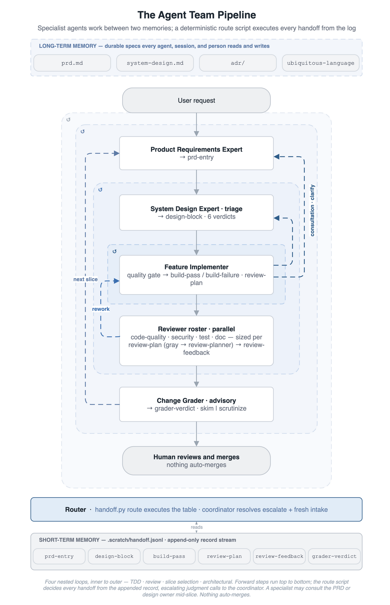

# Agentic Coding Reference

*Agentic coding that amplifies an engineer's judgment instead of replacing it.*

Ship in days what would otherwise die in triage: work worth trying but not worth weeks, built and tested against real users instead of shelved. The machinery that makes that repeatable — durable specs and nested feedback loops that keep every agent, session, and person pointed the same way — is the substance underneath.

**The shape, in one minute.** A file-based pipeline of nine one-job specialist agents builds one vertical slice at a time. Each appends a schema-validated record to a shared log, a coordinator routes from it, and four reviewers plus a change-grader gate every change — nothing auto-merges. The work runs through four nested feedback loops, from the inner TDD cycle out to whole-codebase review, so drift is caught before it compounds. Durable specs — PRD, system design, ADRs, ubiquitous language — are the shared memory every agent, session, and person reads and writes. One `CLAUDE.md` carries it across four agent tools; `/materialize` and `/harvest` adopt it in your project and feed improvements back.

<p align="center">
  
</p>

AI coding agents face the same two challenges human engineers always have: keeping **long-term memory** across sessions, and running **multi-scale feedback loops** that catch drift before it compounds. The difference is degree, not kind — a human forgets between Friday and Monday; an agent forgets between one message and the next. Within days, not years, an agentic project that skips the disciplines that compensate starts drifting: terms picked inconsistently session-to-session, settled decisions re-litigated, this week's architecture contradicting last week's.

The fix is to treat the disciplines human teams already built for these problems as the **memory and feedback substrate** — documentation standards, DDD, TDD, ADRs, ubiquitous language, and XP-style nested loops. Every agent, every session, and every person on the codebase reads and writes the same durable specs, so all stay pointed the same direction. A file-based specialist pipeline of nine one-job agents operates it, building one vertical slice at a time, and a single rules file (`CLAUDE.md`) carries it across Claude Code, Copilot CLI, OpenCode, and Junie CLI.

Two working reference implementations (Go, Spring Boot), portable skills, and enforceable documentation standards demonstrate the pattern; a bidirectional `/materialize` + `/harvest` loop adopts it in your own project and feeds improvements back.

It is for anyone running an agentic coding workflow over more than a few sessions: a solo developer driving an agent team past what fits in one conversation, a team where each developer drives their own agent team on a shared codebase, or a human-only team that wants the same discipline against the slower drift humans face. The failure modes are the same; only the speed differs.

The architecture, principles docs, and reference implementations are stable and in active use. The specialist pipeline machinery (JSONL contract, four-reviewer fan-out, capability progression) is operational, though its cost-effectiveness is still being measured (with [Harness Stats](#harness-stats)) and will be revised as evidence accumulates. Treat the disciplines as the validated core and the pipeline machinery as one reference implementation of the shape the harness can take.

→ Deep dive: [`agentic-harness.md`](docs/agentic-harness.md) covers the loop model and handoff contract. [`specialist-agent-workflow.md`](docs/specialist-agent-workflow.md) covers the full architecture and migration playbook. the [`document-writing` skill](harness/core/.claude/skills/document-writing/documentation-standards.md) covers the writing rules that keep agents from guessing.

The sections move from **how it works** to **trying it** to **reference** — read top-down, or jump to what you need.

## The Force Multiplier and Your Part in It

An agent multiplies whatever it is pointed at. Judgment is the scarce input — you supply the design and the standards; the harness supplies the memory, discipline, and execution that amplify them. The disciplines that keep the multiplier raising quality rather than noise — TDD, DDD, owned specs, ADRs — matter more at this speed, not less.

How the work divides:

- **You decide.** Requirements, design, and standards are yours; the agent does not set them.
- **The agent researches and critiques.** It proves or disproves a direction, researches the ground, and surfaces options you had not weighed — widening the choice space you decide within. It improves the inputs to a decision, not the decision.
- **Design is discovered in the dialogue,** and against real user feedback once a slice ships — not in the inner loop, which only settles interface shape. What the dialogue produces is captured as memory at three levels: **what** to build (`prd.md`), **how** it is structured (`system-design.md`), and **why** it won over the alternatives (`adr/`). That separation is what lets a decision outlast the session that made it.

The same collaboration runs at three flight levels, each writing the memory that keeps agents, sessions, and people pointed the same way:

| Flight level | Who decides | The agent's work | What holds the direction |
|---|---|---|---|
| Within a slice | the engineer | proposes, challenges, builds | tests · `system-design.md` |
| Across slices | the team | drives each slice; surfaces conflicts | `prd.md` · ubiquitous language |
| Whole codebase | the architect seat | sweeps for drift at machine speed | `adr/` · `system-design.md` |

The top level is the one teams skip under deadline: whole-codebase coherence review costs days of legwork. The agent does that legwork at machine speed; the architect seat brings the judgment. The multiplier makes the review affordable — it does not remove the seat.

Range is rewarded, not required. The harness amplifies whatever judgment it is given. An engineer who reads the customer, the system, and the code at once catches drift at every level the agent moves through. A less experienced engineer gets the same scaffolding around their own decisions. What it will not do, at any level, is supply judgment that is not there.

The payoff is a build-ship-watch loop measured in days, not weeks — short enough to keep pace with how user needs actually surface. The harness is the fixed cost that makes this repeatable: paid once, it holds every feature to your standards across sessions, so speed never costs direction.

## What It Looks Like in Practice

You type one sentence. The coordinator routes it. Agents read and update long-term memory as they go.

```text
You: "Let's discuss the feature for rate-limiting the public API"

→ coordinator reads .scratch/handoff.jsonl, sees no active feature
→ routes to product-requirements-expert
  ├─ reads  docs/prd.md, docs/ubiquitous-language.md     (existing memory)
  ├─ interviews you on goals + constraints
  ├─ writes docs/prd.md                                  (appends REQ-RL-001…004)
  ├─ writes docs/ubiquitous-language.md                  (appends terms inline as they resolve)
  └─ appends prd-entry record                            (validated against prd-entry.schema.json)

→ coordinator routes to system-design-expert (triage)
  ├─ reads  docs/system-design.md, docs/adr/, docs/ubiquitous-language.md
  ├─ runs the five-signal foundational check
  ├─ verdict: "new" — genuinely new design ground for this slice
  ├─ writes docs/system-design.md                        (token-bucket section)
  ├─ writes docs/adr/0007-rate-limiting.md               (why token-bucket over leaky-bucket)
  └─ appends design-block record                         (verdict: new)

→ coordinator routes to feature-implementer
  ├─ reads  prd.md + system-design.md + ubiquitous-language.md + latest prd-entry/design-block — modifies none
  ├─ TDD inner loop: red → green → refactor              (design discovery; tests accrue as behavioral memory)
  ├─ if implementer hits a question the triage didn't anticipate:
  │   ├─ appends consultation-request to system-design-expert
  │   ├─ coordinator dispatches system-design-expert in consultation mode
  │   ├─ system-design-expert appends consultation-response (possibly with memory_updates)
  │   └─ coordinator routes control BACK to the implementer (not forward)
  └─ appends build-pass record                           (quality gate: build, test, lint, deps-check)

→ coordinator spawns 4 reviewers in parallel
  └─ security, code-quality, tests, docs → review-feedback records (one per author)

→ coordinator routes to change-grader (terminal, advisory)
  └─ reads the diff, writes grader-verdict record (clear | concern) — surfaced to you; nothing auto-merges
→ doc-sync verifies prd.md / system-design.md / ubiquitous-language.md / code have not drifted
```

Each step either updates a durable spec in `docs/` or appends to the per-feature log in `.scratch/` — the project's two memory tiers.

## Memory and Feedback

The substrate has two faces. As **memory**, each durable artifact records a decision so no single session has to hold it. As **feedback**, the same artifacts and the nested loops catch drift while it is still cheap to fix. **Long-term memory** lives in `docs/` — durable specs that evolve across features. **Working memory** lives in `.scratch/` — the per-feature handoff log and implementation plan, cleared after merge.

Each artifact plays a memory role, a feedback role, or both:

| Artifact | Memory role | Feedback role |
|---|---|---|
| `docs/prd.md` | What the system is meant to do | Acceptance criteria for the inner loop |
| `docs/system-design.md` | How the system is structured — invariants, patterns, guardrails | Triage validates new slices against it |
| `docs/adr/*.md` | Why decisions were made; what was rejected (including non-goal ADRs) | Architectural review catches drift from committed decisions |
| `docs/ubiquitous-language.md` | Project vocabulary; terms to avoid; relationships | Inline term-drift challenge catches misuse mid-conversation |
| Tests (TDD) | Behavioral expectations that survive | Red → green → refactor at seconds-to-minutes |
| Quality gate (build, test, lint, deps-check) | Records what currently passes | Catches regressions on every build |
| Review records (`review-feedback`) | Audit trail of objections raised | Block merge until addressed |
| Handoff log (`.scratch/handoff.jsonl`) | Per-feature audit trail of every transition | Each record is schema-validated before the next dispatch |

Feedback runs in four nested loops — the structure XP introduced. Where flight levels are coordination scope, these loops are design scope: what each cycle settles, not who aligns on it. What separates them is the unit each one iterates over and the question it answers:

| Loop | Iterates over | What design question it surfaces |
|---|---|---|
| Inner | one behavior — red → green → refactor | What does this behavior need? (Interface design) |
| Middle | one slice — triage, consultation, and review until all approve | What does this slice deliver? (Acceptance design + system-design adjustments) |
| Outer | the queue of slices | What slice should we build next? (Feature design + slice sizing) |
| Architectural | the whole codebase | Is the whole codebase still well-shaped? (Structural review — planned) |

The design block from the middle-loop triage is a **starting hypothesis**, not a contract. The inner loop is free — and expected — to discover better shape; a consultation-request routes mid-loop discoveries back to the system-design-expert when they are worth crystallizing as long-term memory. Good interfaces and tests fall out of the inner loop; the larger architecture takes shape in the dialogue the outer loops frame.

## The Pipeline

The core pattern is a file-based specialist pipeline. Each agent has one job, reads defined inputs, and writes to known outputs — record producers append to a shared handoff log, the coordinator routes from it. The filesystem is the coordination layer: auditable, interruptible, tool-agnostic. The figure near the top of this page shows the shape; the breakdown below adds the verdicts, retries, and consultation roundtrip.

```text
User Request
  │
  ▼
Pipeline Coordinator ─── validates each record against its JSON Schema, routes to next agent
  │
  ▼
Product Requirements Expert ──→ prd-entry record (+ ubiquitous-language updates)
  │
  ▼
System Design Expert (triage) ──→ design-block record
  │     verdict: covered | minor | new | refactor-first | foundational | conflicting
  │     conflicting → halts; user decides
  ▼
Feature Implementer ──→ quality gate (build, test, lint, deps-check)
  │
  │  ↻ inner loop — TDD: red → green → refactor; tests accrue as behavioral memory
  │
  │  ↺ middle loop — consultation roundtrip (mid-inner-loop)
  │    ├─ implementer appends consultation-request
  │    ├─ coordinator dispatches system-design-expert in consultation mode
  │    ├─ system-design-expert appends consultation-response (+ memory edits)
  │    └─ coordinator routes control BACK to implementer
  │
  │  ✗ middle loop — build-failure: up to 3 retries → system-design-expert
  │       re-triage; new design-block supersedes prior
  │
  │ (build-pass)
  ▼
4 Reviewers (parallel) ──→ review-feedback records (one per author)
  │
  │  ↺ middle loop — review cycle: any changes_requested / blocked →
  │       owner agent processes findings → re-run quality gate → re-invoke reviewers
  │
  │ (all four approved)
  ▼
Change Grader (terminal, advisory) ──→ grader-verdict record (clear | concern)
  │
  ▼
Human reads the grade and merges — nothing auto-merges
  │
  ╰──↺ outer loop — coordinator selects the next slice, back to the top
```

Inner, middle, and outer are three of the four nested loops described above; an **architectural loop** wraps all three (see [Capability Progression](#capability-progression)).

Each arrow is an append to `.scratch/handoff.jsonl`. The coordinator validates each new record against its per-type JSON Schema in `schemas/scratch/` before routing. A malformed or missing record bounces back to the upstream agent; the next specialist is not dispatched. The coordinator only routes, never implements.

Four living documents are the pipeline's long-term memory, each with a single owner agent that alone writes to it:

| Document | Role | Owner Agent | Describes |
|----------|------|-------------|-----------|
| `docs/prd.md` | Strategic truth | product-requirements-expert | **What** to build — goals, requirements, acceptance criteria, constraints |
| `docs/system-design.md` | Tactical truth | system-design-expert | **How** to build — architecture, invariants, patterns, guardrails |
| `docs/adr/*.md` | Decision records | system-design-expert (architectural ADRs); product-requirements-expert (non-goal ADRs) | **Why** — trade-offs, alternatives considered, what was rejected |
| `docs/ubiquitous-language.md` | Vocabulary truth | product-requirements-expert | **Words** — domain terms, relationships, terms to avoid |

The feature-implementer reads all four but modifies none. The boundary rule is simple: **if it would change when switching languages, it belongs in `system-design.md`, not the PRD.** The PRD uses behavioral language ("the system retries the operation"), never code ("call `Retry()`"). The ubiquitous language updates inline as terms resolve during requirements interviews — drift is challenged mid-conversation, not absorbed silently. See the [`document-writing` skill](harness/core/.claude/skills/document-writing/documentation-standards.md) for the full ownership matrix and cross-reference rules.

The system-design-expert plays the **principal-or-senior-engineer archetype**: the cross-feature mental model stays in its head, and only the load-bearing parts get crystallized into `system-design.md` and `adr/`. It runs in two demand-driven modes — *triage* on every slice (returns one of six verdicts), and *consultation* when the implementer hits a question mid-loop. After a consultation-response, the coordinator routes back to the implementer, not forward to the next pipeline stage.

If the implementer fails the quality gate, it appends a `build-failure` record. The coordinator retries with that error context for up to three attempts, then re-triages with the system-design-expert; the new design-block supersedes the prior one and the retry counter resets.

Agents read these documents before every task and guess when they are vague. So the docs follow enforceable standards: a 30-word sentence cap, one owner per level, tables over prose, parseable templates for PRD entries, ADRs, and state machines. The same rules that make docs clear for agents make them clear for humans. See [prohibited patterns](harness/core/.claude/skills/document-writing/documentation-standards.md#prohibited-patterns) for what not to write.

## Change Grading

After the four reviewers approve, they have answered *is this change correct*. A terminal `change-grader` answers a different question the gate does not: **how much human attention this passing change deserves before it merges.** It reads the actual diff — a deterministic extractor produces a structural row (files, modules, churn, sensitive paths, test/prod ratio, reviewer and retry history) that maps *where to look*, never the verdict — and grades five facets: blast radius, semantic surprise, test adequacy, reviewer hedging, and scope deviation. Each facet definition lives in [`docs/agentic-harness.md`](docs/agentic-harness.md#change-grading-in-depth).

Aggregation is **worst-facet, never average.** Any facet of concern makes the whole change a `concern`; all clear makes it `clear`. The grade is **advisory-only**: nothing routes on the verdict, nothing auto-merges — a human always makes the merge click. The point is to concentrate scarce review on the changes where judgment pays off and let the obvious-safe ones move fast, without ever rubber-stamping a clean-looking row unread.

The grader returns a rendered report — the surface a human reads at the merge point. The verdict leads (a reader can stop there); the facet sections are the evidence. One `Concern` facet flips the whole grade:

```markdown
# Change Grade — REQ-014: tighten retry-counter reset

## Verdict — Concern: semantic surprise
Reset now fires on partial-build failures too, not just clean ones — ...
_Advisory only; nothing auto-merges._

Extracted: 2 files, internal/pipeline · +31/−4 · no sensitive paths · build ✓ · 4/4 approved · 0 retries

## Blast Radius — Clear
Contained to one module; no public API ...

## Semantic Surprise — Concern
Counter reset widened to the partial-failure ...

## Test Adequacy — Clear
New test exercises the partial-failure ...

## Reviewer Hedging — Clear
Four clean approvals, no ...

## Scope Deviation — Clear
Matches the prd-entry slice ...
```

## Tool-Use Limits and Continuation

Each agent dispatch runs under a tool-call cap, and the SDK truncates a dispatch that reaches it. Two mechanisms keep long dispatches recoverable.

**Before** the dispatch, a Scoping Pre-Check runs two independent checks. **Scope** asks whether the work spans more than one behavior — answered from the inbound records, not the budget; a multi-behavior slice bounces back to re-scope. **Length** lets a single-behavior dispatch that simply runs long proceed, naming a checkpoint where it hands off a partial-artifact record.

**After** a truncation, recovery **continues the same slice.** A fresh re-dispatch reads the working tree and the partial-artifact record and picks up where it stopped, rather than re-splitting. Re-split is reserved for genuine over-scope, and repeated non-convergence escalates to a design re-triage. So a dispatch that hits the ceiling loses little work and resumes deterministically, instead of restarting from scratch.

In Claude Code, the continuation can resume the *same* sub-agent in place instead of re-dispatching. The samples enable the experimental agent-teams capability for this (set in `.claude/settings.json`), then constrain the resume channel with a `PreToolUse` hook that accepts only the literal `continue` (`.claude/hooks/sendmessage-continue-only.sh`). The reason is the auditable-ledger invariant: a resume must never smuggle new, unrouted instructions — all new work goes through a fresh, schema-validated dispatch on the handoff log. The hook fails closed, so a non-`continue` resume is denied, never silently accepted.

## Model Tier Assignment

Each specialist's model is pinned in its agent definition. The split follows task type, under a fixed objective ordering: quality bar first, cost second, wall-clock time third.

| Tier | Agents |
|------|--------|
| Opus 4.8 | product-requirements-expert, system-design-expert, feature-implementer, security-reviewer, change-grader |
| Sonnet 4.6 | pipeline-coordinator, code-quality-reviewer, test-reviewer, doc-reviewer |

Judgment roles get the premium tier. Requirements framing, architecture triage, TDD implementation, off-checklist vulnerability hunting, and the terminal merge-attention grade are open-ended reasoning; their errors compound downstream.

Checklist and routing roles sit one tier below. Verifying a diff against an explicit rubric is an easier task than generating the code. The quality gate (build, test, lint) runs as a mechanical correctness oracle before any reviewer. The coordinator routes against JSON Schemas, so a misroute costs a re-triage hop, not a shipped defect. At $3/$15 per million tokens against Opus at $5/$25, the mixed reviewer fan-out costs 70% of a uniform-Opus one.

Two rules keep the split stable across model releases. Judgment reviewers (security-reviewer, change-grader) move with the implementer's tier — never below it. The test-reviewer is the watch item: a defect that escapes an approved test review promotes it to the judgment tier.

Models are pinned to explicit versions, not aliases, so a release never shifts pipeline behavior silently; bumps happen through a deliberate `deps-upgrade` run. Rationale and rejected alternatives: [`docs/adr/2026-06-11-model-tier-assignment.md`](docs/adr/2026-06-11-model-tier-assignment.md).

## Quick Start

### Try a reference implementation

```bash
# Go
cd samples/go/
make ci                      # tidy, fmt, vet, lint, deps-check, test, build

# Java Spring Boot
cd samples/java-spring-boot/
./gradlew build              # compile, format check, test, package
```

### Use with an agent tool

Open either project directory. Configuration loads automatically.

```bash
cd samples/go/          # or cd samples/java-spring-boot/
claude          # Claude Code
copilot         # Copilot CLI
opencode        # OpenCode
junie           # Junie CLI
```

## Adopt in Your Own Project

The monorepo root ships skills that form a bidirectional loop between this reference and real projects. They run from the root in Claude Code and detect the stack from the target's build marker: `go.mod` picks Go, `pom.xml` or `build.gradle` picks Spring Boot, and any other technology falls back to the generic stack (bind it through `scripts/stack.sh`). `/materialize` runs reference → your project; `/harvest` runs the opposite direction, pulling generalizable improvements from your project back into `/harness` — language-agnostic findings land in `core/`, stack-specific ones in `stacks/<stack>/`.

`/materialize` both onboards and upgrades, because complete replacement made them the same operation: it **completely replaces** the project's harness-owned runtime with the current `/harness`. On a fresh target it scaffolds the project-owned files first (via `/init`); on an existing one it reinstalls the runtime, removes stale orphans, and preserves any skill or agent the project added — asking before it touches anything ambiguous. Project-owned files (briefs, `layout.toml`, `CLAUDE.md`) are never rewritten.

| Command | Direction | What it does |
|---------|-----------|--------------|
| `/materialize <project-path>` | Reference → your project | Detect the stack; scaffold project-owned files via `/init` if missing; **completely replace** the runtime from `/harness`; remove stale orphans; keep project extensions (ask when unsure); respect the project's declared channel; validate with the doctor. |
| `/harvest <project-path>` | Your project → reference | Diff a real project against the materialized harness. Classify each change as **harvest** (generic improvement), **skip** (domain-specific), or **ask** (ambiguous). Auto-generalize domain patterns on the way back (`REQ-DL-*` → `REQ-XX-*`, `internal/render/render.go` → `internal/example/handler.go`); route language-agnostic improvements to `core/`. |

### Onboard or upgrade: the steps

Skills run inside Claude Code, from the monorepo root, via `/skill-name <args>`. The same command onboards a new project and upgrades an existing one.

1. **Provide a build skeleton.** The target must already hold a build marker — `go.mod` (Go), or `pom.xml` / `build.gradle` / `build.gradle.kts` (Spring Boot). `/materialize` detects the stack from it and never generates build files. Create one first with `go mod init`, `gradle init`, or Spring Initializr.
2. **Run `/materialize <project-path>`** from the reference root. On a new target it answers two prompts — project name and description — and asks which tool surfaces to install. The channel is **not** prompted: it is detected, defaulting a greenfield target to **copy** (see [Distribution channels](#distribution-channels)).
3. **It scaffolds, installs, and validates.** A new target gets its project-owned files first (via `/init`): `CLAUDE.md`, `.claude/settings.json`, `scripts/layout.toml`, the six `docs/` briefs, and the `.gitignore` block. Then it installs the runtime, removes stale orphans, keeps any skill or agent you added, and runs the doctor.
4. **Commit.** Under the copy channel the runtime is committed with your project; under manifest it stays gitignored.

```bash
$ cd agentic-coding-reference
$ claude

# Onboard a new project — scaffolds project files, then installs the runtime.
> /materialize ../my-service

# Upgrade an existing project — same command. Reinstalls the runtime, prunes
# orphans, keeps your own skills/agents, runs the doctor.
> /materialize ../my-existing-service

# Harvest — pull improvements from your project back into the reference.
> /harvest ../my-existing-service
```

### Options you control

Three knobs live in the target's `scripts/layout.toml` `[harness]` table. `/init` writes them at onboarding; to change one later, edit the table and re-run `/materialize`.

| Option | Values | Effect |
|---|---|---|
| `channel` | `copy` *(default)* · `manifest` · `marketplace` | Whether the runtime is committed, gitignored, or shipped as a plugin. Detected on onboarding (marketplace is declaration-only); switching is manual ([Distribution channels](#distribution-channels)). |
| `tools` | `claude` (always on) + any of `copilot`, `opencode`, `junie` | Which AI-tool agent surfaces are installed. `/materialize` installs only these and never adds one on upgrade. |
| `extensions` | runtime-relative paths | Skills or agents you added under the runtime tree. `/materialize` keeps them, never prunes them, and the doctor leaves them tracked. |

### Customize after onboarding

The scaffolded files are yours to fill — `/materialize` never rewrites them on upgrade. Run **`/audit-docs`** to check the content: it runs the structural doctor first, then the advisory judgment review, and reports both. See [The Harness–Project Contract](#the-harnessproject-contract) for the ownership split.

1. **Fill the four structure-only briefs** — `docs/prd.md`, `docs/system-design.md`, `docs/ubiquitous-language.md`, and `docs/adr/` carry your requirements, architecture, vocabulary, and decisions.
2. **Tune the three house-default briefs if your rules differ** — `docs/testing-principles.md`, `docs/architecture-principles.md`, and `docs/security-principles.md` arrive filled with the harness's default policy and work as-is. They are the extension points for testing, architecture, and security principles: change them here when your project's rules differ from the defaults.
3. **Fill the Security Context** in `docs/system-design.md` — the security-reviewer reads the project's security profile from the brief.
4. **Adjust `scripts/layout.toml`** — set the module-derivation rules and `prod_roots` to your package layout.
5. **Run `/audit-docs`** once the briefs have content — it runs the doctor (structure) then the judgment review, auditing each doc on its own and against the others.

Improvements discovered while shipping real features flow back into the template via `/harvest`. Template improvements flow out to every downstream project via `/materialize`. Neither direction overwrites domain work.

## The Harness–Project Contract

The dependency runs both ways. Agents enforce a project's briefs as their own convictions, so a vague or self-contradicting brief degrades every dispatch that reads it. The project, in turn, accumulates truth no upgrade may clobber: requirements, decisions, policies. The boundary that protects both is a versioned API — [`harness-project-api.md`](docs/harness-project-api.md), spec 0.1.0 — not a convention. Why an API rather than shared documents: [the docs-as-API ADR](docs/adr/2026-06-12-docs-as-harness-project-api.md).

The API is an **open–closed boundary**. The opinionated core is closed: a project never edits it, and an upgrade replaces it wholesale. The project extends from outside instead — rewriting the three house-default briefs to its own testing, design, and security philosophy, adding its own skills and agents, and selecting its tool surfaces. Each extension is a declaration the project owns, so an upgrade refreshes the core without ever colliding with it. This is what keeps the harness maintainable across many consumers: one source evolves, and no project forks it to specialize.

A project owns seven briefs under `docs/`. Four arrive as structure only — their content is yours from the first line. Three arrive as filled defaults carrying the harness's house policy; these are the **adaptation points** a project rewrites to its own philosophy:

| Brief | Arrives as | Yours to set |
|---|---|---|
| `prd.md` | structure only | Requirements, goals, acceptance criteria |
| `system-design.md` | structure only | Architecture, invariants, guardrails |
| `adr/` | structure only | Decisions and their rationale |
| `ubiquitous-language.md` | structure only | Domain vocabulary |
| **`testing-principles.md`** | **filled default — adaptation point** | Testing philosophy: pyramid ratios, mocking policy, coverage target |
| **`architecture-principles.md`** | **filled default — adaptation point** | Architecture philosophy: module boundaries, pattern catalog, naming |
| **`security-principles.md`** | **filled default — adaptation point** | Security philosophy: trust boundaries and the stack's high-bar defaults |

A rewritten default is policy, not drift. Each materialized brief says so on its first line (`this file is owned by the project`); the three defaults open by naming what you may rewrite and what is kernel-fixed. The harness materializes a missing brief from its template and never writes an existing one.

Upgrades replace only the runtime: skills, agents, hooks, schemas, scripts. A project that needs its own skill or agent declares it in `[harness] extensions`. The harness keeps it beside its own runtime and never prunes it on upgrade — the runtime-side counterpart of a rewritten brief.

Underneath the briefs, four disciplines are kernel — fixed because the machinery breaks without them:

| Kernel discipline | What is fixed | What stays project-owned |
|---|---|---|
| **TDD-first** | A failing test precedes production code; the nine-clause quality bar | Pyramid ratios, coverage target, mocking policy, test-naming style |
| **Strategic DDD** | Four properties: ubiquitous language, bounded modules, an isolated unit-testable domain core, the state-vs-history split (design docs carry what is, ADRs carry why) | The tactical pattern catalog realizing them — repositories, mappers, naming rules |
| **Spec-driven delivery** | PRD before design before code; the append-only handoff ledger and its record, tag, and verdict vocabularies | All content: requirements, design, decisions |
| **Form contract** | Principles over rules; 30-word sentences; data over adjectives | The content the form carries |

The admission test: a discipline enters the kernel only when the machinery breaks without it, never because we like it. The kernel closes *properties*; briefs carry *patterns*. A team can reject the word "repository" — it cannot reject "the domain core is testable without infrastructure."

Enforcement follows the same ownership split. The `doctor` skill is deterministic and blocking: all seven briefs present, required sections and numeric slots filled, no harness-owned handbook docs left in `docs/` — 32 checks in stdlib Python, CI-runnable. It verifies structure, never your choices. The `audit-docs` skill is the human-facing entry point: it runs the doctor first, then adds the judgment and advisory pass. That pass asks whether your principles are enforceable, contradiction-free, and carry their rationale — each on its own and against the others. It can question a policy; it cannot override one. It is also how harness evolution reaches a project-owned file: a new expectation arrives as a finding with an offered draft, applied only on your consent — never as a write.

Facts enforced by judgment live in briefs; facts consumed by deterministic engines live in `scripts/layout.toml` — test file globs, the test-name regex, and the `[harness]` table's channel, tool surfaces, and declared extensions. Each skill declares the briefs it reads in frontmatter; the doctor audits those declarations against the expectations manifest.

### Distribution channels

The contract holds on every distribution channel; only the delivery of the runtime differs, and the project-owned files stay committed on all of them.

<p align="center">
  
</p>

| Channel | Runtime delivery | Git state | When |
|---|---|---|---|
| **Copy** *(default)* | committed into the project | runtime tracked | The default. Self-contained, version-controlled, diffable in code review — the mode both samples use. |
| **Manifest** | materialized from the `/harness` source into the project's native tool locations | runtime gitignored, doctor-enforced untracked | Opt in to keep the repo lean and pin the runtime to a single source. |
| **Marketplace** | tool surfaces (skills, agents, hooks) ship as a plugin; the plugin bundles the engine sliver and a `marketplace-setup` skill installs it project-side | runtime gitignored, doctor-enforced untracked | `harness/package-marketplace.sh` renders the runtime into per-tool plugins under one `.claude-plugin/marketplace.json`. Read by Claude Code, Copilot CLI, and Junie CLI. |

`/init` **resolves the channel — it does not prompt.** It uses what is already declared in `[harness] channel`; failing that, it infers from git state (a runtime that is committed → copy, gitignored → manifest); a greenfield target defaults to **copy**. `/materialize` then respects whatever is declared and never flips it.

**Switching is manual** and rare:

- **copy → manifest:** set `[harness] channel = "manifest"`, append the runtime block from `harness/init/core/gitignore-runtime.txt` to `.gitignore`, then untrack the now-ignored runtime: `git rm -r --cached --ignore-unmatch <runtime paths>`.
- **manifest → copy:** set `[harness] channel = "copy"`, remove that runtime block from `.gitignore` (keep `.scratch/`), then `git add` the runtime and commit.

**Installing from the marketplace.** The reference repo *is* the marketplace — one root `.claude-plugin/marketplace.json` listing one plugin per (stack, tool): `go-claude`, `go-copilot`, `go-junie`, `spring-boot-claude`, `spring-boot-copilot`, `spring-boot-junie`. A consumer adds it, installs the plugin for their stack and tool, restarts, then runs the one-time engine setup:

```
claude plugin marketplace add woditschka/agentic-coding-reference   # or a local clone path
claude plugin install go-claude@agentic-harness
# restart your tool — plugin skills load at session start
/go-claude:marketplace-setup                                     # namespaced by the plugin
```

Plugin skills and commands are **namespaced by the plugin name** — a consumer types `/go-claude:…`, not `/…`. Only user-typed entry points carry the prefix; the pipeline's own agent-to-agent skill use is by intent, so the namespace stays internal. The skill and agent bodies never hardcode a prefix (the source is shared across all plugins); `harness/test-marketplace.sh` enforces that. The `marketplace-setup` skill installs the engine sliver project-side and gitignores it; project-owned files come from `init`.

Both samples are consumers of their own harness on the copy channel and pass their own doctor.

## Reference Documentation

The [`docs/`](docs/) directory is the harness's own documentation, grouped by role below — all read-only reference: the contract, how the machinery works, and why each kernel discipline is fixed. The default briefs a project receives (testing, architecture, and security) ship as doctor templates in the harness, not as files here; the kernel rationale behind them lives in `tdd-principles.md` and `ddd-principles.md` below.

| Document | Role | Covers |
|----------|------|--------|
| [`harness-project-api.md`](docs/harness-project-api.md) | Contract | The harness–project API: seven-file brief roster, required sections, validation contract (spec 0.1.0) |
| [`agentic-harness.md`](docs/agentic-harness.md) | Internals | The four-loop model, slice definition, agent roster, handoff contract, triage and consultation modes |
| [`specialist-agent-workflow.md`](docs/specialist-agent-workflow.md) | Internals | Pipeline architecture, cross-tool compatibility, capability progression, migration playbook |
| [`document-writing` skill](harness/core/.claude/skills/document-writing/documentation-standards.md) | Internals | Writing for agents, document ownership, validation checklist |
| [`adr/`](docs/adr/) | Internals | Decision log — why the harness evolved (options, trade-offs); the *why* behind the Project History timeline |
| [`tdd-principles.md`](harness/core/.claude/skills/tdd-workflow/tdd-principles.md) | Kernel rationale | TDD as design discovery via the inner loop (XP-rooted), nine-clause conjunctive bar |
| [`ddd-principles.md`](docs/ddd-principles.md) | Kernel rationale | Strategic DDD: the four kernel properties and why tactical patterns are brief-variable |

## Reference Implementations

Go and Spring Boot represent different paradigms — explicit vs convention-driven. When a pattern works in both, it transfers. When they diverge, the differences are instructive.

| | Go ([`samples/go/`](samples/go/)) | Java Spring Boot ([`samples/java-spring-boot/`](samples/java-spring-boot/)) |
|---|---|---|
| **Toolchain** | Go 1.26, golangci-lint, Make | Java 25, Gradle 9.5.1, Spring Boot 4.1.0 |
| **Agents** | 9 specialists across 4 tools | 9 specialists across 4 tools |
| **Skills** | 19 portable skills | 21 portable skills (incl. 2 IntelliJ oracle skills) |
| **Entry point** | [`samples/go/CLAUDE.md`](samples/go/CLAUDE.md) | [`samples/java-spring-boot/CLAUDE.md`](samples/java-spring-boot/CLAUDE.md) |

Each implementation is self-contained. The project `CLAUDE.md` is the authoritative source for build commands, conventions, and agent workflow within that directory.

## Cross-Tool Compatibility

All four major AI coding tools read `CLAUDE.md` natively or via configuration. Skills in `.claude/skills/` are discovered by all four. Agent definitions are tool-specific — each tool has its own directory; bodies stay identical, only frontmatter differs.

| Location | Claude Code | Copilot CLI | OpenCode | Junie CLI |
|----------|:-----------:|:-----------:|:--------:|:---------:|
| `CLAUDE.md` | Yes | Yes (native) | Yes (fallback) | Yes (config) |
| `.claude/skills/*/SKILL.md` | Yes | Yes | Yes | Yes |
| `.claude/agents/*.md` | Yes | — | — | — |
| `.github/agents/*.agent.md` | — | Yes | — | — |
| `.opencode/agents/*.md` | — | — | Yes | — |
| `.junie/agents/*.md` | — | — | — | Yes |

Creating `AGENTS.md` breaks OpenCode's fallback to `CLAUDE.md`. Creating `copilot-instructions.md` causes additive merging. One rules file avoids both problems.

For JetBrains, Cursor, or Windsurf plugin users, see [IDE Compatibility](docs/specialist-agent-workflow.md#3-ide-compatibility) for the symlink-based extension path. That section also covers using IntelliJ IDEA's MCP server as a read-only semantic oracle and verifier. It is optional and demonstrated in the Java Spring Boot sample ([setup and rationale](samples/java-spring-boot/.claude/skills/intellij-idea/intellij-mcp-integration.md)): wired and working for Claude Code, and wired for Copilot CLI ahead of an upstream fix.

## Capability Progression

The harness grew from a single prompt by adding one capability at a time, each closing a specific failure of the one before it. Add a capability when you hit the failure it closes — not before. The far end is this reference's demonstration, not a target; measure with Harness Stats before adding any layer.

- **Single generalist prompt:** One model, one context, no persistence. Nothing survives between messages; every session restarts from zero. The baseline the others improve on.
- **Rules file (`CLAUDE.md`):** The first long-term memory. Conventions, build commands, and workflow persist across sessions, so the agent stops re-deriving the project's basics every time it starts.
- **Skills:** Reusable, invokable workflow knowledge. Procedures the agent would otherwise improvise — auditing, reviewing, releasing — become named, repeatable operations shared across every tool.
- **Specialist subagents:** One job each, in isolated contexts. A requirements agent, a design agent, an implementer — so no single context carries every concern and drifts under the load.
- **Coordinated routing:** A coordinator reads the handoff log, validates each record, and routes to the next specialist. Working memory becomes auditable and interruptible — the point where the pipeline coordinates itself.
- **Parallel review fan-out:** Four reviewers run concurrently against one diff — security, quality, tests, docs — trading more review-phase tokens for faster, wider feedback before a feature lands.

Around this runs a slower **architectural loop** — periodic drift review that writes back to long-term memory. Today it reviews the reference itself (cross-project consistency, docs, agent parity, upstream changes, versions); pointing it at application-code structural decay is the open extension. See [§4 of the workflow doc](docs/specialist-agent-workflow.md#4-capability-progression) for the full path and the frontier beyond it.

## Pipeline Maintenance

One pattern keeps the pipeline healthy between features:

| Pattern | Purpose |
|---------|---------|
| `doc-sync` | Detect and fix drift between `docs/prd.md`, `docs/system-design.md`, `docs/ubiquitous-language.md`, and the codebase after features merge. |

See [§7 of the workflow doc](docs/specialist-agent-workflow.md#7-pipeline-maintenance-patterns) for the full process.

## Reference Upkeep

Nine root-level skills keep this reference itself consistent (the `init`/`materialize`/`harvest` adoption skills are covered in [Adopt in Your Own Project](#adopt-in-your-own-project)):

| Skill | Purpose |
|-------|---------|
| `audit-harness` | Hold the reference to a high bar after a change: deterministic battery (`harness/check-sync.sh`), then `audit-consistency`, then an adversarial review of the diff for regressions, lost coverage, and incoherence — one verdict. |
| `release-prep` | Roll `/harness` out to both samples and the marketplace, then run the full battery — the propagate-and-verify step before a release. |
| `release-version` | Cut one lockstep version: evaluate the semver bump, confirm, write `harness/VERSION`, run `release-prep`, then stage the `v<VERSION>` tag and commit — stops before push. |
| `research-update` | Fetch upstream tool docs, compare claims against current state, report drift. |
| `audit-consistency` | Verify both implementations match root docs and each other. |
| `deps-upgrade` | Check pinned tool/plugin/dependency versions against upstream, bump and verify. |
| `harness-stats-setup` | Install or update the user-level statusline and cache-report tooling from `tools/harness-stats/` into `~/.claude/`. |
| `history-update` | Refresh the Project History section in the README with executive-level milestones since the last entry. |
| `diagram-update` | Regenerate the README architecture figures in one house style when the harness changes; owns the `docs/images/*.drawio` sources and the draw.io export. |

## IntelliJ Semantic Oracle

Optional tooling that connects IntelliJ IDEA's MCP server to the agent as a **read-only semantic oracle and verifier**. The motivation is grounding. An agent reasons over text, so it answers semantic questions from its priors — plausible guesses that need not match this codebase. *What does this name resolve to? Where is it really used? Does this Spring bean wire up? Does the edit compile?* The oracle replaces the guess with the IDE's computed answer.

What the agent gains, ordered by how firmly each holds:

| Gain | What it means |
|------|---------------|
| **Grounded information** | Answers come from the IDE's resolved model of *this* project: inferred types, semantic usages, the compiler's verdict, framework-aware inspections (Spring wiring, JPA, nullability), and the resolved transitive dependency graph. None of this is readable off disk — a text-only agent would have to simulate the compiler and type-checker. The agent acts on facts, not priors. |
| **Determinism** | The same code yields the same answer — a lookup, not a probabilistic judgment. |
| **Fewer detours** | A compact resolved answer can spare the agent from reading and reasoning across multiple files to reconstruct the same fact. |

The server is read-only by policy: no exposed tool mutates a file. The agent stays the sole writer, so the oracle adds a verification signal without a new failure mode. It is optional and degrades cleanly. When the IDE is absent or its index is stale, every workflow falls back to native tools plus the project build — the canonical gate. The grounding is only as fresh as the IDE's index, so a one-command health check (`intellij-idea-doctor`) guards against trusting a stale model.

Today the oracle is wired and working for Claude Code and wired for Copilot CLI (gated by an upstream bug). Junie CLI runs in headless mode on the native baseline; OpenCode is the next wiring target. The oracle is demonstrated in the Java Spring Boot sample; the Go sample is not wired. See [`samples/java-spring-boot/.claude/skills/intellij-idea/intellij-mcp-integration.md`](samples/java-spring-boot/.claude/skills/intellij-idea/intellij-mcp-integration.md) for the exposed tool set, the exposure policy, setup, and per-client status.

**Consider it if** your agents work in an IDE-backed language and you want a grounded, deterministic check in the loop. The pattern transfers to any editor exposing an MCP server; the Java sample is one instance.

## Harness Stats

Running a constellation of specialists has a cost the chat UI does not surface. How many tokens are flowing? Is the prompt cache amortizing the repeated specialist fires? Which subagent is about to hit its tool ceiling and truncate? Harness Stats makes it visible — a live statusline on every turn and an on-demand per-agent report. This is the feedback loop turned on the harness itself: the instrument for the cost-effectiveness question raised up front.

A statusline mid-fan-out, with agent teams enabled (project shown as `sample`):

```text
sample ⎇ main │ opus ▤ 47% │ Σ ▲4.2M ▼91k $11.40 │ ⛁ 95% ⊖3.9M ⊕210k $84% │ ⇲ 12 context7·8 │ ⇉ 3 │ ⟳ 9 │ ↺ doc-reviewer ⊕9k ⚒18 ⟳2 │ ↗ feature-implementer ⚒54 ⟳7
```

Read left to right:

- Project directory and git branch.
- Parent model and context-window usage (`▤`), color-coded as it fills.
- Session totals (`Σ`) — input (`▲`), output (`▼`), and list-price API cost (`$`), summed across the parent and every subagent.
- Cache (`⛁`) — hit rate, tokens read (`⊖`) versus written (`⊕`), and spend change versus uncached (`$%`).
- MCP usage (`⇲`) — total calls and the busiest server, shown only when the session calls MCP.
- Parallel fan-out (`⇉`) — subagents active in the last 5 minutes (a 3-wide burst of one agent type reads as `⇉ 3`).
- Continuation total (`⟳`) — session-wide accepted re-engagements, shown only when agent teams is on.
- Last turn (`↺`) and any at-risk hot agent (`↗`) — agent name, cache writes (`⊕`), cumulative tool count (`⚒`), and continues (`⟳`) when agent teams re-engages it.

A subagent nearing the SDK's per-invocation tool ceiling turns its `⚒` count yellow then red, with a `⚠` when it hits — unless agent teams is actively re-engaging it (`⟳`), in which case the count is coordinator-driven and the alarm is suppressed. The on-demand `cache-report` breaks the same figures down per agent — runs, warm-start %, net savings % — exposing which specialists pay for their cache writes and which fire too sporadically to amortize.

| Skill | Purpose |
|-------|---------|
| `harness-stats-setup` | Install or update the tooling. Detects drift between this repo and `~/.claude/`, applies on approval, merges the `statusLine` block into `~/.claude/settings.json` without clobbering other keys. |
| `cache-report` | Run the per-agent report on demand (installed by the setup skill). |

See [`tools/harness-stats/README.md`](tools/harness-stats/README.md) for the full cell reference, metric formulas, and platform support.

## Repository Structure

```text
.
├── docs/                              # Cross-cutting principles + decision log (adr/)
├── harness/                           # Single canonical harness source — samples materialize from here
│   ├── core/                          # Runtime shared by every stack
│   ├── stacks/<stack>/                # Stack-specific runtime (go, java-spring-boot, generic)
│   ├── init/                          # Skeletons for the files a project owns (not runtime)
│   ├── materialize.sh                 # Install the runtime into a target
│   ├── init.sh                        # Scaffold the project-owned files
│   └── bootstrap.sh                   # Detect each target's stack, then materialize
├── samples/                           # Materialized instances of the harness (copy channel)
│   ├── go/                            # Go reference implementation
│   │   ├── CLAUDE.md                  # Project rules — committed (all 4 tools read this)
│   │   ├── docs/                      # Project briefs — committed, project-owned
│   │   ├── scripts/layout.toml        # Channel + module rules — committed
│   │   └── .claude/ .github/ .opencode/ .junie/   # Runtime — materialized from /harness, committed
│   ├── java-spring-boot/              # Spring Boot reference implementation (same shape as go/)
│   └── generic/                       # Technology-free starting template — inspect and copy; verbs unbound, briefs {{FILL}}
├── tools/                             # Optional companion tooling
│   └── harness-stats/                 # Cache-efficiency statusline + report
├── .claude/skills/                    # Root maintenance skills (init, materialize, harvest, audit-consistency, …)
└── CLAUDE.md                          # Monorepo instructions
```

## Project History

- **2026-03-24** — Launch the specialist-agent pattern with Go and Spring Boot reference implementations.
- **2026-04 → 2026-05** — Build out template upkeep and cross-tool compatibility: maturity levels, bidirectional `/seed`+`/harvest` sync, the pipeline quality bar, four supported tools (Claude Code, Copilot CLI, OpenCode, Junie CLI), cache diagnostics.
- **2026-05-08** — Switch handoff coordination to a schema-validated JSONL append log.
- **2026-05-22** — Reframe the harness around memory and feedback; add the four-loop model and consultation roundtrips.
- **2026-05-27 → 2026-05-31** — Bound dispatches with budgets and start/stop events; add the IntelliJ MCP read-only oracle, the refactor-first verdict, and harness invariants.
- **2026-06-03** — Adopt Anthropic's principles-over-rules model; enrich agent personas; add the judgment-rationale audit gate.
- **2026-06-07 → 2026-06-11** — Make dispatch recovery first-class: the change-grader advisory grade, cap-hit-recovery-as-continuation with hook-gated continue-only resume, model-tier pinning, and the deterministic handoff-log tool.
- **2026-06-12** — Decide the docs-as-API architecture: project-owned briefs, an expectation-spec contract, dual-channel plugin distribution.
- **2026-06-13** — Land the harness–project API (spec 0.1.0): single-source the runtime from one stack-agnostic `/harness`, materialize it per project behind a blocking doctor plus advisory `/audit-docs`, framed as an open-closed boundary projects extend from outside.
- **2026-06-14** — Publish the harness as a plugin marketplace: six per-tool plugins under one `marketplace.json` with self-installing engine slivers, copy as the default detected channel, a decoupled `harness/VERSION`, and release tooling plus architecture diagrams — gated end-to-end by `check-sync`, including a real plugin install.
- **2026-06-16** — Make security a first-class producer dimension: `secure-by-design` as the ninth conjunctive-bar clause and a project-owned `security-principles.md` brief, with a cross-tool agent-body parity gate in `audit-harness`.
- **2026-06-17** — Add a generic, technology-free fallback stack. Its one binding surface is a lifecycle-verb contract: a harness-owned dispatcher (`scripts/gate.sh`) fixes the verbs (`deps, format, lint, test, build`) and the rule that an unbound verb fails honestly; a project-owned `scripts/stack.sh` holds the bodies the owner fills in. Skills, `CLAUDE.md`, and agents speak only in verbs, never tool names, so the unchanged pipeline drives any technology. Detection falls back to generic when no marker is recognized — Go and Java stay byte-for-byte untouched, new opinionated stacks still slot in parallel — and `test-generic-stack.sh` gates the contract.
## Disclaimer

This is a personal learning project. It documents patterns and ideas the author explored while experimenting with AI coding agents.

Use anything here freely under the [MIT License](LICENSE), but at your own risk. Evaluate everything yourself before applying it to your own work.

This project is not affiliated with, endorsed by, or sponsored by Anthropic, GitHub, or any other tool vendor mentioned in this repository. All product names, trademarks, and registered trademarks are the property of their respective owners and are used here solely for identification and descriptive purposes.

## License

[MIT License](LICENSE)
