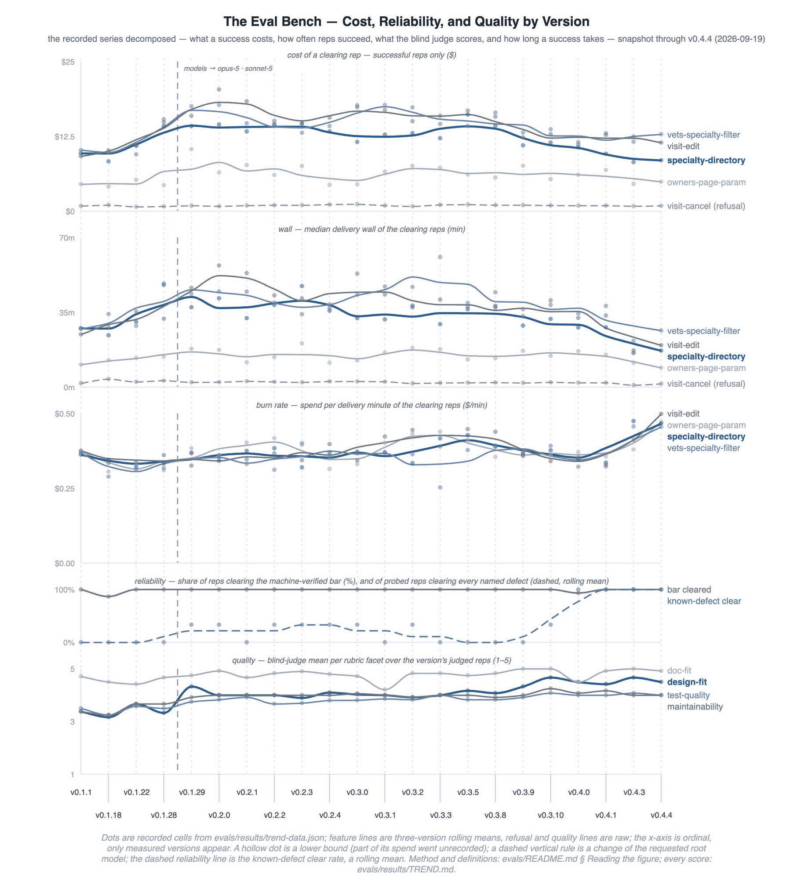

<a href="https://github.com/woditschka/agentic-coding-reference/actions/workflows/checks.yml?query=branch%3Amain+event%3Apush"></a>

# agent-team

*An engineering team behind one conversation.*

Describe a feature. Specialist agents carry it through requirements, design, TDD implementation, review, and grading — on durable specs that remember what agents forget. You make the merge decision. This repository, the **Agentic Coding Reference**, builds, proves, and ships that team.

**Seen, not claimed:** [a real recorded run](docs/feature-walkthrough.md) — bug report to reviewed, graded, merge-ready change in 17 agent-minutes for $8.21, one critical spec defect caught on the way.

**Ship in days what would otherwise die in triage — and hold a high bar for years.** The work worth trying but never worth weeks gets built and tested against real users instead of shelved. The bar holds because durable specs and nested feedback loops keep every agent, session, and person pointed the same way.

> **TL;DR** — Coding agents forget and drift. Better prompts don't fix that; engineering discipline does. This reference turns TDD, DDD, ADRs, ubiquitous language, and durable specs into the memory and feedback substrate an agentic coding workflow runs on. Decisions survive across sessions; nested feedback loops catch drift before it compounds. The pipeline is not the point; the disciplines are. Adopt it with `/materialize` or the `agent-team` marketplace plugins, and run it with Claude Code, Copilot CLI, OpenCode, or Junie CLI.

The depth documented below is for building and extending the harness itself; to adopt agent-team, the [Quick Start](#quick-start) is enough.

## Why This Exists

To build software that lives for years — and hold it to a high bar on quality and maintainability the whole way. Agents make the building fast; documentation, tests, and recorded decisions are what keep a codebase coherent long after any single session — and those are exactly what agent work erodes by default. An agent forgets between one message and the next, the way a human forgets between Friday and Monday. Within days, a project that skips the compensating disciplines drifts: inconsistent terms, re-litigated decisions, this week's architecture contradicting last week's.

The harness's answer is the disciplines human teams already built — documentation standards, DDD, TDD, ADRs, ubiquitous language, XP-style nested loops. They become the **memory and feedback substrate** every agent, session, and person reads and writes ([the full statement](docs/agentic-harness.md#what-the-harness-is-for)). A specialist agent team operates it through a file-based pipeline, building one vertical slice at a time. A single rules file (`CLAUDE.md`) carries it across Claude Code, Copilot CLI, OpenCode, and Junie CLI.

Two working reference implementations (Go, Spring Boot), portable skills, and enforceable documentation standards demonstrate the pattern; a bidirectional `/materialize` + `/harvest` loop adopts it in your own project and feeds improvements back.

<p align="center">
  
</p>

The substrate has two faces. As **memory**, each durable artifact records a decision so no single session has to hold it. **Long-term memory** lives in `docs/` — durable specs that evolve across features; **working memory** lives in `.scratch/`, the per-feature handoff log, cleared after merge. As **feedback**, the same artifacts and four XP-style nested loops catch drift while it is still cheap to fix. The loop model, the artifact roster, and the handoff contract are in [`agentic-harness.md`](docs/agentic-harness.md).

It is for anyone running an agentic coding workflow over more than a few sessions:

- a solo developer driving an agent team past what fits in one conversation;
- a team where each developer drives their own agent team on a shared codebase;
- a human-only team that wants the same discipline against the slower drift humans face.

The failure modes are the same; only the speed differs.

The architecture, principles docs, and reference implementations are stable and in active use. The specialist pipeline machinery (JSONL contract, reviewer-roster fan-out, capability progression) is operational, and its cost is measured two ways: [Harness Stats](docs/adoption-guide.md#harness-stats) instruments the live session, and the [eval bench](evals/README.md) tracks cost per pass across harness versions against a fixed subject project. Treat the disciplines as the validated core and the pipeline machinery as one reference implementation of the shape the harness can take.

The sections move from **how it works** to **trying it** to **evidence and reference**.

## The Force Multiplier and Your Part in It

An agent multiplies whatever it is pointed at. Judgment is the scarce input — you supply the design and the standards; the harness supplies the memory, discipline, and execution that amplify them. The disciplines that keep the multiplier raising quality rather than noise — TDD, DDD, owned specs, ADRs — matter more at this speed, not less.

How the work divides:

- **You decide.** Requirements, design, and standards are yours; the agent does not set them.
- **The agent researches and critiques.** It proves or disproves a direction, researches the ground, and surfaces options you had not weighed — widening the choice space you decide within. It improves the inputs to a decision, not the decision.
- **Design is discovered in the dialogue,** and against real user feedback once a slice ships — not in the inner loop, which only settles interface shape. What the dialogue produces is captured as memory at three levels: **what** to build (`prd.md`), **how** it is structured (`system-design.md`), and **why** it won over the alternatives (`adr/`). That separation is what lets a decision outlast the session that made it.

The same collaboration runs at three flight levels, each writing the memory that keeps agents, sessions, and people pointed the same way:

| Flight level | Who decides | The agent's work | What holds the direction |
|---|---|---|---|
| Within a slice | the engineer | proposes, challenges, builds | tests · `system-design.md` |
| Across slices | the team | drives each slice; surfaces conflicts | `prd.md` · ubiquitous language |
| Whole codebase | the architect seat | sweeps for drift at machine speed | `adr/` · `system-design.md` |

The top level is the one teams skip under deadline: whole-codebase coherence review costs days of legwork. The agent does that legwork at machine speed; the architect seat brings the judgment. The multiplier makes the review affordable — it does not remove the seat.

Range is rewarded, not required. The harness amplifies whatever judgment it is given. An engineer who reads the customer, the system, and the code at once catches drift at every level the agent moves through. A less experienced engineer gets the same scaffolding around their own decisions. What it will not do, at any level, is supply judgment that is not there.

The payoff is a build-ship-watch loop measured in days, not weeks — short enough to keep pace with how user needs surface. The harness is the fixed cost that makes this repeatable: paid once, it holds every feature to your standards across sessions, so speed never costs direction.

## What It Looks Like in Practice

You type one sentence. The router dispatches each hop — a script for decided transitions, a coordinator for untriaged intake and escalations. Agents read and update long-term memory as they go.

```text
You: "Let's discuss the feature for rate-limiting the public API"

→ root interviews you directly (goals, constraints, non-goals)
  └─ you confirm the exit; your decisions are recorded verbatim (intake-decision)
→ product-requirements-expert judges the quoted intake cold
  └─ writes docs/prd.md + ubiquitous language · appends prd-entry (schema-validated)
→ system-design-expert triages the slice against durable memory
  └─ verdict "new" · writes docs/system-design.md + an ADR · appends design-block
→ feature-implementer runs the TDD inner loop (red → green → refactor)
  ├─ a question the triage missed? consultation-request → answer → control
  │  returns to the implementer, never forward
  └─ appends build-pass (quality gate: build, test, lint, deps-check)
→ reviewer roster in parallel: security · code-quality · tests · docs
→ change-grader (advisory): how much human attention the passing change
  deserves — nothing auto-merges; you make the merge decision
```

The trace above is schematic; the [feature walkthrough](docs/feature-walkthrough.md) narrates a committed run record by record — ledger, review findings, fix routing, escalation, grade, and cost included. Each step either updates a durable spec in `docs/` or appends to the schema-validated log in `.scratch/` — the filesystem is the coordination layer: auditable, interruptible, tool-agnostic.

## Quick Start

### Try a reference implementation

```bash
# Go
cd samples/go/
make ci                      # the full quality gate

# Java Spring Boot
cd samples/java-spring-boot/
./gradlew build              # compile, format check, test, package
```

### Use with an agent tool

Open any sample directory. Configuration loads automatically.

```bash
cd samples/go/          # or samples/java-spring-boot/, samples/generic/
claude          # Claude Code
copilot         # Copilot CLI
opencode        # OpenCode
junie           # Junie CLI
```

### Adopt in your own project

One command onboards a new project and upgrades an existing one. From this reference's root in Claude Code, `/materialize ../my-service` installs the runtime and keeps your files; `/harvest ../my-service` pulls improvements back. One `/harness` source reaches a consumer over three channels — copy (default), manifest, or the marketplace plugins this reference itself publishes. The release checkout, the steps, the channel semantics, the ownership contract, and the no-clone plugin install are in the [Adoption Guide](docs/adoption-guide.md).

## Reference Implementations

Go and Spring Boot represent different paradigms — explicit vs convention-driven. When a pattern works in both, it transfers. When they diverge, the differences are instructive.

| | Go ([`samples/go/`](samples/go/)) | Java Spring Boot ([`samples/java-spring-boot/`](samples/java-spring-boot/)) |
|---|---|---|
| **Toolchain** | Go 1.27, golangci-lint, Make | Java 25, Gradle 9.7.1, Spring Boot 4.1.1 |
| **Agents** | 10 specialists across 4 tools | 10 specialists across 4 tools |
| **Skills** | 24 portable skills (incl. 2 GoLand oracle skills) | 24 portable skills (incl. 2 IntelliJ oracle skills) |
| **Entry point** | [`samples/go/CLAUDE.md`](samples/go/CLAUDE.md) | [`samples/java-spring-boot/CLAUDE.md`](samples/java-spring-boot/CLAUDE.md) |

Each implementation is self-contained. The project `CLAUDE.md` is the authoritative source for build commands, conventions, and agent workflow within that directory. A third, technology-free instance ([`samples/generic/`](samples/generic/)) binds its build through `scripts/stack.sh` verb stubs. One `CLAUDE.md` and one `.claude/skills/` tree serve all four tools; agent bodies are identical per tool, only frontmatter differs — matrices, IDE paths, and gotchas in [`cross-tool-strategy.md`](docs/cross-tool-strategy.md).

## The Eval Bench

Claims about agent harnesses are cheap; measurements are not. **The series is public:** [`TREND.md`](evals/results/TREND.md) prices every released harness version against one fixed subject project — cost per pass, waste, and wall, one table per task, straight down the versions. Every figure is regenerated from the committed run folders, never hand-edited. The [eval bench](evals/README.md) holds the method: frozen prompts and a machine-verified bar — a held-out oracle plus the full suite. An advisory blind judge scores each passing change so quality drift the binary bar cannot see stays visible.

<p align="center">
  
</p>

> The figure is a dated snapshot (its subtitle carries the stamp); [`TREND.md`](evals/results/TREND.md) is the live series it summarizes, with per-rep links and the dated operator notes.

The loop closes on this repository itself. The bench caught its first cost regression — a stochastic review-cycle reset re-running the full reviewer battery — and the fix landed as [ADR 2026-08-07](docs/adr/2026-08-07-review-cycle-survives-mid-slice-design-records.md) with engine tests pinning it; the forensics live in the [trend's dated notes](evals/results/TREND.md). When the harness changes, a dev sweep prices the candidate against the tagged series before the version is cut.

## Where to Go Next

| You want to… | Read |
|---|---|
| Watch one real feature go through | [`feature-walkthrough.md`](docs/feature-walkthrough.md) — a recorded run narrated record by record: findings, fixes, escalation, grade, cost |
| Understand the machinery in depth | [`agentic-harness.md`](docs/agentic-harness.md) — the four-loop model, slice definition, agent roster, handoff contract, grading, recovery |
| Adopt the harness in your project | [Adoption Guide](docs/adoption-guide.md) — onboarding, upgrading, distribution channels, the ownership contract, optional tooling |
| Study the architecture or migrate stepwise | [`specialist-agent-workflow.md`](docs/specialist-agent-workflow.md) — design principles, capability progression, canonical layout, migration playbook |
| Compare or configure the four agent tools | [`cross-tool-strategy.md`](docs/cross-tool-strategy.md) — rules-file/skill/agent matrices, IDE paths, tool-choice framework |
| Check the contract a project owns | [`harness-project-api.md`](docs/harness-project-api.md) — the seven-brief roster and validation contract (spec 0.2.0) |
| Write documents agents can execute | [`document-writing` skill](harness/core/.claude/skills/document-writing/documentation-standards.md) — writing standards, ownership, prohibited patterns |
| See what a session costs, live | [Adoption Guide § Harness Stats](docs/adoption-guide.md#harness-stats) — statusline cells, per-agent cache report, setup |
| Measure a harness version | [`evals/README.md`](evals/README.md) — cost per pass against a fixed SUT; results in [`TREND.md`](evals/results/TREND.md) |
| See why each specialist runs its model tier | [ADR 2026-06-11](docs/adr/2026-06-11-model-tier-assignment.md) — the split rules, pin policy, and cost math |
| Look up a harness term | [Glossary](docs/glossary.md) — the working vocabulary, each entry linking its canonical home |
| Understand why the harness evolved this way | [`docs/adr/`](docs/adr/) — the decision log; pairs with the [milestone timeline](docs/project-history.md) |
| See why the kernel disciplines are fixed | [`tdd-principles.md`](harness/core/.claude/skills/tdd-workflow/tdd-principles.md) · [`ddd-principles.md`](docs/ddd-principles.md) |
| Maintain this reference | [`CLAUDE.md`](CLAUDE.md) — the maintainer loop and root skills · [`harness/README.md`](harness/README.md) — the source tree, scripts, and battery |

## Repository Structure

```text
.
├── docs/                              # Principles, guides, and the decision log (adr/)
├── harness/                           # Single canonical harness source — samples materialize from here
│                                      #   core/ + stacks/<stack>/ + init/ + claude-md/ + marketplace/ + *.py/*.sh — see harness/README.md
├── samples/                           # Materialized instances of the harness (copy channel)
│   ├── go/                            # Go reference implementation
│   ├── java-spring-boot/              # Spring Boot reference implementation
│   └── generic/                       # Technology-free starting template — verbs unbound, briefs {{FILL}}
├── evals/                             # Harness eval bench: frozen tasks vs. a fixed SUT, per version (results/TREND.md)
├── tools/                             # Optional user-level tooling (installs to ~, never into a project)
│   ├── harness-stats/                 # Cache-efficiency statusline + report
│   └── claude-dev/                    # Container-confined Claude Code for reduced-approval runs
├── .claude-plugin/                    # Generated: marketplace.json (the reference IS a marketplace)
├── plugins/                           # Generated: per-tool plugins, rendered by package-marketplace.py
├── .claude/skills/                    # Root maintenance skills (init, materialize, harvest, audit-harness, …)
└── CLAUDE.md                          # Monorepo instructions + the maintainer loop
```

## Project History

### Before This Project

The research did not begin with a harness. It began in a chat box and moved through four phases as the tooling — and the ambition — grew:

- **From 2022** — *Simple prompting.* ChatGPT (Nov 2022) and Claude (Mar 2023) make coding help a single prompt in a chat window: one question, one answer, no memory between them.
- **From ~Aug 2025** — *Agents and skills.* With Claude Code (research preview Feb 2025, general availability May 2025) and Agent Skills (Oct 2025) in hand, experimentation moves from one-shot prompts to agent-driven coding and reusable skills.
- **Late 2025** — *Subagents.* Around Claude Opus 4.5 (Nov 24, 2025), deeper subagent experiments start producing results worth keeping — the output satisfied; the ad-hoc setup around it did not.
- **Early 2026** — *The harness.* To hold that quality bar repeatably while cutting cost, the experiments harden into a harness, driven by three values: insist on the highest standards, invent and simplify, stay frugal. This project captures and documents the result.

<p align="center">
  
</p>

> The arc is grounded in observation — the trends are drawn from agent-session logs and the milestones in the [project history](docs/project-history.md). Read the shapes as directional: they capture how quality, autonomy, cost, and maintainability moved across the project, conveying the trend rather than exact values.

The goal throughout: learn how to build and maintain an effective, efficient harness over the long term — one that produces code to the author's standards, session after session. The thinking was shaped as much by conversations as by tooling — at the [XP × AI Unconference](https://xpunconf.org/) (Berlin, Sep 2025), Devoxx Belgium 2025, and Spring I/O (Barcelona, 2025 and 2026). Chip Huyen's [*AI Engineering*](https://www.oreilly.com/library/view/ai-engineering/9781098166298/) (O'Reilly, 2025) substantially shaped the understanding underneath it.

The dated milestone timeline — one line per qualifying shift, from the 2026-03-24 launch onward, no rollups — is [`docs/project-history.md`](docs/project-history.md).

## Disclaimer

This is a personal learning project. It documents patterns and ideas the author explored while experimenting with AI coding agents.

Use anything here freely under the [MIT License](LICENSE), but at your own risk. Evaluate everything yourself before applying it to your own work.

This project is not affiliated with, endorsed by, or sponsored by Anthropic, GitHub, or any other tool vendor mentioned in this repository. All product names, trademarks, and registered trademarks are the property of their respective owners and are used here solely for identification and descriptive purposes.

## License

[MIT License](LICENSE)
