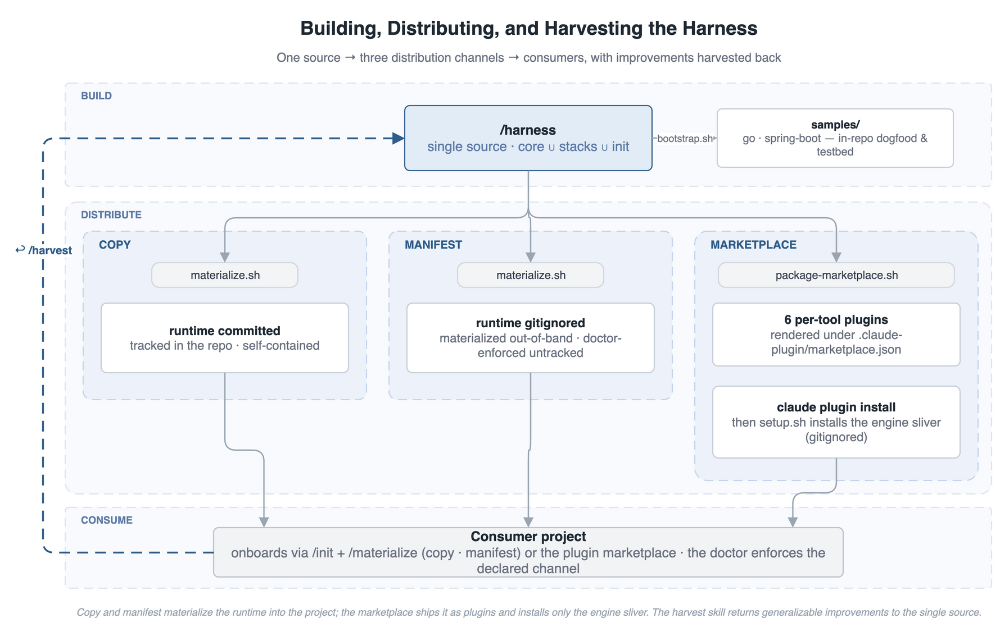

# Adoption Guide

How to run **agent-team** — the specialist team this reference ships — in a real project: onboarding, upgrading, the ownership contract, the distribution channels, and the optional tooling around the pipeline. The [README](../README.md) carries the concepts and the pitch; this guide carries the procedures. Every command runs from a clone of this reference unless noted.

## Adopt in Your Own Project

One command adopts a project; the same command upgrades it later. The harness adopts a project, it never scaffolds one — the target must already hold its build. The project keeps everything it owns — `CLAUDE.md`, `scripts/layout.toml`, and the seven `docs/` briefs. The runtime — skills, agents, hooks, schemas, scripts — installs beside them and is completely replaced on every upgrade. The one decision up front is delivery. **Copy**, the default, installs from a clone of this reference: runtime committed with the project, diffable in review (**manifest** is its gitignored variant). **Marketplace** installs as a plugin, no clone needed ([plugin-shipped init](adr/2026-08-02-plugin-shipped-init.md)). Semantics and switching: [Distribution channels](#distribution-channels).

```bash
# Default path — from a clone of this reference:
$ git fetch --tags && git checkout $(git describe --tags --abbrev=0 origin/main)   # latest release, not main
$ claude
> /materialize ../my-service      # onboard — and later upgrade: the same command
```

```bash
# Plugin path — in the target project's session, no clone needed:
> /plugin marketplace add woditschka/agentic-coding-reference
> /plugin install agent-team-go@agent-team   # or agent-team-spring-boot / agent-team-generic
# restart the tool — plugin skills load at session start
> /agent-team:init                # new project only: scaffold the project-owned files
> /agent-team:marketplace-setup   # install the engine sliver; re-run per plugin update
```

Either path ends the same way: open the project in the chosen tool, describe a feature, and the pipeline takes it from there. The install validates itself — `/materialize` runs the installed suites and the blocking doctor — and `/audit-docs` reviews the briefs' content on demand. A project with existing code drafts its briefs from the source first with `/derive-briefs` ([Brownfield](#brownfield-fill-the-briefs-from-the-code)). The clone path's full procedure: [Onboard or upgrade: the steps](#onboard-or-upgrade-the-steps).

The monorepo root ships skills that form a bidirectional loop between this reference and real projects. They run from the root in Claude Code and detect the stack from the target's build marker — the marker table lives in the [`init` skill](../.claude/skills/init/SKILL.md), its code home in `harness/registry.py`. `/materialize` runs reference → project; `/harvest` runs the opposite direction, pulling generalizable improvements from the project back into `/harness` — language-agnostic findings land in `core/`, stack-specific ones in `stacks/<stack>/`.

`/materialize` **completely replaces** the project's harness-owned runtime with the current `/harness` — complete replacement is what makes onboarding and upgrading the same operation. On a fresh target it scaffolds the project-owned files first (via `/init`). On an existing one it reinstalls the runtime, removes stale orphans, and preserves any skill or agent the project added — asking before it touches anything ambiguous. Project-owned files (briefs, `layout.toml`, `CLAUDE.md`) are never rewritten — except the harness-managed chapters inside `CLAUDE.md`, refreshed in place on every upgrade.

| Command | Direction | What it does |
|---------|-----------|--------------|
| `/materialize <project-path>` | Reference → project | Detect the stack; scaffold project-owned files via `/init` if missing; **completely replace** the runtime from `/harness`; remove stale orphans; keep project extensions (ask when unsure); respect the project's declared channel; verify the installed suites; validate with the doctor. |
| `/harvest <project-path>` | Project → reference | Diff a real project against the materialized harness. Classify each change as **harvest** (generic improvement), **skip** (domain-specific), or **ask** (ambiguous). Auto-generalize domain patterns on the way back (`REQ-DL-*` → `REQ-XX-*`, `internal/render/render.go` → `internal/example/handler.go`); route language-agnostic improvements to `core/`. |

### Onboard or upgrade: the steps

Step 1 runs in the shell; every later step is a skill, run inside Claude Code from the monorepo root via `/skill-name <args>`. The same command onboards a new project and upgrades an existing one.

1. **Check out the latest release.** In a clone of this reference: `git fetch --tags && git checkout $(git describe --tags --abbrev=0 origin/main)` — `main` may carry unreleased work stamped with the previous release date.
2. **Provide a build skeleton.** The target must already hold a recognized build marker (the [`init` skill](../.claude/skills/init/SKILL.md)'s marker table); `/materialize` detects the stack from it and never generates build files. Create one with `go mod init`, `gradle init`, or Spring Initializr — or copy a `samples/` implementation as a starting template. A target with no recognized marker falls back to the **generic** stack: run `/materialize`, then bind the build in `scripts/stack.sh`.
3. **Run `/materialize <project-path>`** from the reference root. On a new target it answers two prompts — project name and description — and asks which tool surfaces to install. The channel is **not** prompted: it is detected, defaulting a greenfield target to **copy** (see [Distribution channels](#distribution-channels)).
4. **It scaffolds, installs, and validates.** A new target gets its project-owned files first (via `/init`): `CLAUDE.md`, `.claude/settings.json`, `scripts/layout.toml`, the seven `docs/` briefs, and the `.gitignore` block. Then it installs the runtime, removes stale orphans, keeps any skill or agent the project added, and runs the doctor.
5. **Commit.** Under the copy channel the runtime is committed with the project; under manifest it stays gitignored.

```bash
$ cd agentic-coding-reference
$ git fetch --tags && git checkout $(git describe --tags --abbrev=0 origin/main)
$ claude

# Onboard a new project — scaffolds project files, then installs the runtime.
> /materialize ../my-service

# Upgrade an existing project — same command. Reinstalls the runtime, prunes
# orphans, keeps project skills/agents, runs the doctor.
> /materialize ../my-existing-service

# Harvest — pull improvements from the project back into the reference.
> /harvest ../my-existing-service
```

### Brownfield: fill the briefs from the code

Onboarding scaffolds four `docs/` briefs as structure-only stubs and three with house defaults. A greenfield project fills the stubs as it goes. A project adopted with a history already answers them — in its source rather than in prose. **`/derive-briefs`** reads that answer out, and runs inside the target project rather than from the reference root.

It marks every statement with how it is known: *derived* from code, *confirmed* by a human with the date, or *not recoverable*. The rule it enforces is that observed behavior is not an intended requirement. Code records that a decision was made, never why. A survey presenting an observation as a settled intention invents institutional memory a later reader cannot tell from the record.

Worked example — the upstream project [`spring-petclinic`](https://github.com/spring-projects/spring-petclinic) at commit `88e37c1`, onboarded on the plugin path ([§ Adopt](#adopt-in-your-own-project)): the project commits only its own files (`CLAUDE.md`, `scripts/layout.toml`, the briefs); the runtime arrives as a plugin plus a gitignored engine sliver. Then, in the project session:

```bash
$ cd spring-petclinic && claude
> /agent-team:derive-briefs            # survey the codebase, draft the briefs
> /agent-team:audit-docs               # doctor (structure) + judgment review
```

The survey produced 16 requirements from the boundary surface and 25 contracts, 19 of them linked to a requirement and six recorded as serving none. It added seven domain terms and seven ADRs whose Context and Options Considered it recorded as not recoverable — the reasoning predates the repository, and no interview can recover it. The owner then withdrew one requirement as an implementation artifact.

It also recorded five known defects rather than writing them up as intent. One — a duplicate pet name surfacing as an error page under MySQL ([ADR 2026-07-31](adr/2026-07-31-derived-briefs-carry-provenance.md)) — was visible only because deriving the requirement exposed a divergence no test in the default suite observes.

The briefs it writes are a first draft. Open questions go to the project's owner, and each answer that lands becomes a confirmed statement with its date; the rest stay open and stay marked. `/derive-briefs` writes `docs/` and nothing else — a defect it records becomes a slice the pipeline runs later, against the requirement the survey wrote.

### Project-controlled options

Seven knobs live in the target's `scripts/layout.toml` `[harness]` table. `/init` writes the first five at onboarding; to change one later, edit the table and re-run `/materialize`.

| Option | Values | Effect |
|---|---|---|
| `channel` | `copy` *(default)* · `manifest` · `marketplace` | Whether the runtime is committed, gitignored, or shipped as a plugin. Detected on onboarding (marketplace is declaration-only); switching is manual ([Distribution channels](#distribution-channels)). |
| `tools` | `claude` (always on) + any of `copilot`, `opencode`, `junie` | Which AI-tool agent surfaces are installed. `/materialize` installs only these and never adds one on upgrade. |
| `extensions` | runtime-relative paths | Skills, agents, or `scripts/` files the project added under the runtime tree (materialize records kept project scripts here too). `/materialize` keeps them, never prunes them, and the doctor leaves them tracked. |
| `extra_reviewers` | reviewer names (`*-reviewer`) | Reviewers added to the parallel review gate, on top of the mandatory four-reviewer floor. Additive only — the floor cannot be dropped. Naming, body, and extension constraints: [the API spec](harness-project-api.md#briefs-feed-agents-data-files-feed-engines). |
| `auto_grade` | `true` *(default)* · `false` | Whether the pipeline auto-dispatches the terminal, advisory change-grader after the roster approves. Semantics and the fail-open rule: [the API spec](harness-project-api.md#briefs-feed-agents-data-files-feed-engines). |
| `prd_max_words` · `system_design_max_words` | word counts | Raise the doctor's doc word ceilings (defaults 18000 and 12000); absent means the defaults. `/init` does not write them. Semantics: [the API spec](harness-project-api.md#briefs-feed-agents-data-files-feed-engines). |

One more surface, the optional `[review]` table in the same file, sizes review dispatch to the change's risk; anything unclassifiable fails closed to the full roster. Key semantics: [the API spec](harness-project-api.md#briefs-feed-agents-data-files-feed-engines); mechanics and rationale: [Risk-Proportional Review Dispatch](adr/2026-07-09-risk-proportional-review.md).

### Customize after onboarding

The scaffolded files are the project's to fill — `/materialize` never rewrites them on upgrade (the one exception: the harness-managed `CLAUDE.md` chapters, refreshed deterministically). On a project with existing code, **`/derive-briefs`** drafts them from the source first ([Brownfield](#brownfield-fill-the-briefs-from-the-code)). Run **`/audit-docs`** to check the content: it runs the structural doctor first, then the advisory judgment review, and reports both. See [The Harness–Project Contract](#the-harnessproject-contract) for the ownership split.

1. **Fill the four structure-only briefs** — `docs/prd.md`, `docs/system-design.md`, `docs/ubiquitous-language.md`, and `docs/adr/` carry the project's requirements, architecture, vocabulary, and decisions.
2. **Tune the three house-default briefs if the project's rules differ** — `docs/testing-principles.md`, `docs/architecture-principles.md`, and `docs/security-principles.md` arrive filled with the harness's default policy and work as-is. They are the extension points for testing, architecture, and security principles: change them here when the project's rules differ from the defaults.
3. **Fill the Security Context** in `docs/system-design.md` — the security-reviewer reads the project's security profile from the brief.
4. **Adjust `scripts/layout.toml`** — set the module-derivation rules and `prod_roots` to the project's package layout. Classify generated sources deliberately: exclude code generated from external API models (OpenAPI, protobuf) from `prod_roots`, or give it its own module rule; an unclassified path flows to the grader's cautious default.
5. **Run `/audit-docs`** once the briefs have content — it runs the doctor (structure) then the judgment review, auditing each doc on its own and against the others.
6. **Start the first slice.** Open the project in the chosen tool — `cd <project>`, then `claude` (or `copilot`, `opencode`, `junie`) — and describe the feature. The pipeline takes it from there; `/next` recommends the next requirement from PRD coverage.

Improvements discovered while shipping real features flow back into the template via `/harvest`. Template improvements flow out to every downstream project via `/materialize`. Neither direction overwrites domain work.

## The Harness–Project Contract

The dependency runs both ways. Agents enforce a project's briefs as their own convictions, so a vague or self-contradicting brief degrades every dispatch that reads it. The project, in turn, accumulates truth no upgrade may clobber: requirements, decisions, policies. The boundary that protects both is a versioned API — [`harness-project-api.md`](harness-project-api.md), spec 0.2.0 — not a convention. Why an API rather than shared documents: [the docs-as-API ADR](adr/2026-06-12-docs-as-harness-project-api.md).

The API is an **open–closed boundary**. The opinionated core is closed: a project never edits it, and an upgrade replaces it wholesale. The project extends from outside instead — rewriting the three house-default briefs to its own testing, design, and security philosophy, adding its own skills and agents, and selecting its tool surfaces. Each extension is a declaration the project owns, so an upgrade refreshes the core without ever colliding with it. This is what keeps the harness maintainable across many consumers: one source evolves, and no project forks it to specialize.

A project owns seven briefs under `docs/`. Four arrive as structure only — `prd.md`, `system-design.md`, `adr/`, `ubiquitous-language.md` — their content is the project's from the first line. Three arrive as filled defaults carrying the harness's house policy — `testing-principles.md`, `architecture-principles.md`, `security-principles.md` — the **adaptation points** a project rewrites to its own philosophy. The full roster and owning agents are specified in [`harness-project-api.md` § File Roster](harness-project-api.md#file-roster); each brief's required sections follow it there.

A rewritten default is policy, not drift. The three defaults open by naming what the project may rewrite and what is kernel-fixed. The harness materializes a missing brief from its template and never writes an existing one.

Upgrades replace only the runtime: skills, agents, hooks, schemas, scripts. A project that needs its own skill or agent declares it in `[harness] extensions`. The harness keeps it beside its own runtime and never prunes it on upgrade — the runtime-side counterpart of a rewritten brief.

That runtime executes on the host: the `scripts/*.py` engines and the `.claude/hooks/*.py` that fire on the session's tool calls and its end. What it carries, and what checks it, is part of the contract.

It carries **no third-party dependencies**. Every import resolves to the Python standard library or a module in the same directory, and it ships no dependency manifest. A battery step enforces both, so the claim cannot go quietly stale. A CI workflow runs that battery on every push to `main` and every pull request. At install, `/materialize` runs the vendored suites it just copied and fails loudly when one breaks.

Each check bounds what it guards: [materialize-time verification](adr/2026-07-13-materialize-time-runtime-verification.md) states its own limits. None of it replaces the operator's own evaluation; the [Disclaimer](../README.md#disclaimer) and the [MIT License](../LICENSE) govern use.

Underneath the briefs, four disciplines are kernel — TDD-first, strategic DDD, spec-driven delivery, and the form contract — fixed because the machinery breaks without them. What each fixes, what stays project-owned, and the admission test are specified in [`harness-project-api.md` § The Kernel](harness-project-api.md#the-kernel--what-no-brief-can-vary).

### The architecture default

`architecture-principles.md` ships an opinionated default: the domain core is the fixed point, infrastructure a swappable boundary around it. A request crosses four layers in one direction:

1. **UI / API** — carries its own request/response model; an anti-corruption mapper translates it to and from the domain, which never sees the external shape.
2. **Application (service)** — owns the transaction boundary: it loads aggregates through repositories or external services, calls the domain to run the business logic, then persists the result. No business logic lives here.
3. **Domain core** — entities and value objects inside aggregates, reached only through the aggregate root; the business logic runs here.
4. **Repository / external services** — load, persist, and reach other systems behind an anti-corruption mapper — unless the project owns both ends and persistence tracks the model closely, where the model may be mapped directly.

Persistence is a spectrum — event-sourced to direct mapping — with the default catalog in the shipped brief itself. The five closed protections are owned by [`ddd-principles.md` § Properties Are Kernel](ddd-principles.md#properties-are-kernel-patterns-are-brief-variable); everything outside them — mapping mechanism, ACL implementation, persistence ideology, annotation policy — is adapted by editing that one brief. Rationale and the open–closed decision: [`ddd-principles.md`](ddd-principles.md) and [its ADR](adr/2026-06-26-ddd-open-closed.md).

Enforcement follows the same ownership split. The `doctor` skill is deterministic and blocking. It checks all seven briefs present, required sections and numeric slots filled, the reviewer-roster floor intact, and no harness-owned handbook docs left in `docs/` — stdlib Python, CI-runnable. It verifies structure, never the project's choices. The `audit-docs` skill is the human-facing entry point: it runs the doctor first, then adds the judgment and advisory pass. That pass asks whether the project's principles are enforceable, contradiction-free, and carry their rationale — each on its own and against the others. It can question a policy; it cannot override one. It is also how harness evolution reaches a project-owned file: a new expectation arrives as a finding with an offered draft, applied only with operator consent — never as a write.

Facts enforced by judgment live in briefs; facts consumed by deterministic engines live in `scripts/layout.toml` — test file globs, the test-name regex, and the `[harness]` table's channel, tool surfaces, and declared extensions. Each skill declares the briefs it reads in frontmatter; the `audit-agents` skill audits those declarations against the expectations manifest (a judgment check, not a doctor gate).

### Distribution channels

The contract holds on every distribution channel; only the delivery of the runtime differs, and the project-owned files stay committed on all of them. The section serves four situations: choosing a channel (the table), installing from the marketplace, switching channels, and upgrading a marketplace install.

<p align="center">
  
</p>

| Channel | Runtime delivery | Git state | When |
|---|---|---|---|
| **Copy** *(default)* | committed into the project | runtime tracked | The default. Self-contained, version-controlled, diffable in code review — the mode all three samples use. |
| **Manifest** | materialized from the `/harness` source into the project's native tool locations | runtime gitignored, doctor-enforced untracked | Opt in to keep the repo lean and pin the runtime to a single source. |
| **Marketplace** | tool surfaces (skills, agents, hooks) ship as a plugin; the plugin bundles the engine sliver (scripts, schemas, templates) and a `marketplace-setup` skill installs it project-side | runtime gitignored, doctor-enforced untracked | `harness/package-marketplace.py` renders the runtime into per-tool plugins under one `.claude-plugin/marketplace.json`. Read by Claude Code, Copilot CLI, and Junie CLI. |

`/init` **resolves the channel — it does not prompt.** It uses an explicit invocation argument (`/init <path> marketplace`) or an existing `[harness] channel` declaration; marketplace arrives only those two ways. Failing both, it infers from git state — committed runtime → copy, gitignored → manifest — and a greenfield target defaults to **copy**. `/materialize` then respects whatever is declared and never flips it.

**Switching is manual** and rare:

- **copy → manifest:** set `[harness] channel = "manifest"`, append the runtime block from `harness/init/core/gitignore-runtime.txt` to `.gitignore`, then untrack the now-ignored runtime: `git rm -r --cached --ignore-unmatch <runtime paths>`.
- **manifest → copy:** set `[harness] channel = "copy"`, remove that runtime block from `.gitignore` (keep `.scratch/`), then `git add` the runtime and commit.
- **copy → marketplace:** set `[harness] channel = "marketplace"`. Delete the plugin-delivered surfaces from tree and index: `git rm -r .claude/agents .claude/skills .claude/hooks`. Untrack the engine sliver (`git rm -r --cached` on the remaining runtime paths — the list is `RUNTIME_PATHS` in `scripts/doctor.py`; project-owned `settings.json` and `scripts/layout.toml` stay tracked). Remove the `.claude/hooks/` matchers from `.claude/settings.json` — the plugin's own `hooks.json` registers the hooks from its cache, and the doctor's hook-registration check fails a leftover matcher. Then install the plugin (below); `marketplace-setup` refreshes `.gitignore` and re-installs the sliver. `/materialize` handles the sliver too — it installs only the sliver on this channel. Validated end-to-end on the spring-petclinic fork (2026-08-01).

**Installing from the marketplace.** The reference repo *is* the marketplace — one root `.claude-plugin/marketplace.json` listing one plugin per (stack, tool). Entry names lead with the shared namespace; Claude Code, the primary target, drops the tool suffix: `agent-team-go`, `agent-team-spring-boot`, `agent-team-generic`, plus `agent-team-<stack>-copilot` and `agent-team-<stack>-junie` for the other tools. The install commands are the plugin-path block in [§ Adopt](#adopt-in-your-own-project) (`claude plugin marketplace add …` from a shell works equally, and accepts a local clone path). Both skills carry the shared namespace and run in the project session — marketplace onboarding needs no clone of the reference.

The restart is load-bearing: plugin *skills* register at session start. `/reload-plugins` refreshes an already-installed plugin mid-session, but its "skills" count covers only a plugin's `commands/` directory — `0 skills` after a reload is not evidence the skills are missing.

**Project-scoped install (team onboarding, version pinning).** A project can declare the marketplace and plugin in its committed `.claude/settings.json`, so every collaborator gets the same harness version:

```json
{
  "extraKnownMarketplaces": {
    "agent-team": {
      "source": { "source": "github", "repo": "woditschka/agentic-coding-reference", "ref": "v0.3.3" }
    }
  },
  "enabledPlugins": { "agent-team-spring-boot@agent-team": true }
}
```

The version-stamped install caveats — the first-trust install offer, the per-machine plugin install, container-reachable marketplace sources, one registration route per name — live in [cross-tool-strategy.md § The Gotchas](cross-tool-strategy.md#the-gotchas), the surface `update-research` refreshes. Switching harness versions for a test is a `ref` edit (or `claude plugin marketplace add <https-url>.git#<tag>`), a marketplace update, and a `marketplace-setup` re-run.

Plugin skills carry the **shared `agent-team` namespace** — a consumer types `/agent-team:…`, not `/…`. The marketplace *entry* name (`agent-team-go`) keys installs, the plugin cache, and `enabledPlugins`; the plugin name (`agent-team`) is the skill prefix ([namespace ADR](adr/2026-08-01-shared-plugin-namespace.md), which also records the Copilot/Junie residual). Enable one harness plugin per project — two enabled in one session shadow each other's skills. Only user-typed entry points carry the prefix; the pipeline's own agent-to-agent skill use is by intent, so the namespace stays internal. The `marketplace-setup` skill installs the engine sliver project-side and gitignores it. Project-owned files come from the plugin's own `/agent-team:init` — bundled skeletons, marketplace channel declared by construction; a reference clone's `/init <path> marketplace` stays equivalent.

**Upgrade note — the shared-namespace release.** Plugins installed before it use `<stack>-<tool>` entry names and the old marketplace name `agentic-harness`; a registration or install keyed by an old name no longer matches. Migrate once — the steps ship in the `marketplace-setup` skill; the rationale: [ADR 2026-08-01](adr/2026-08-01-shared-plugin-namespace.md).

**Upgrading a marketplace install.** A plugin update advances only the cached surfaces; the project-side engine sliver and managed CLAUDE.md chapters advance only when `marketplace-setup` re-runs. After every plugin update (Claude Code: refresh the marketplace, then update the plugin; other tools: their equivalent), restart and re-run the setup skill. A missed re-run surfaces two ways: new skills hard-fail against old engines, and the doctor — run with `--plugin-version-date <plugin-root>/VERSION-DATE` on this channel — reports an advisory `WARN version-skew`. Setup re-runs are additive: an update that retires an engine file leaves the old copy behind, gitignored and inert, until removed by hand.

All three samples are consumers of their own harness on the copy channel and pass their own doctor.

## Handoff Append Pre-Approval (One-Time, Per Tool)

`scripts/handoff.py append` is the pipeline's only sanctioned write — append-only, schema-validated, scoped to the log. Each tool's permission layer must pre-approve it so routine appends do not prompt; the agent's tool grant alone does not.

- **Claude Code** — pre-approved by a committed `PreToolUse` hook (`.claude/hooks/handoff-allow.py`, registered in `.claude/settings.json`). It auto-allows `python3 scripts/handoff.py` invocations and defers everything else; a prefix allow-rule cannot cover the heredoc form, so the hook is required. A companion guard (`.claude/hooks/handoff-log-guard.py`) denies raw writes to the log — `Write`/`Edit` tool calls on it and shell redirection onto it.
- **OpenCode** — pipeline agents already declare `bash: allow`, which runs the command without a prompt; no extra setup.
- **Copilot CLI** — launch with `--allow-tool 'shell(python3:*)'`, or add a `preToolUse` hook to its user `config.json`.
- **Junie** — add an allowlist rule `{ "pattern": "python3 scripts/handoff.py **", "action": "allow" }` to `~/.junie/allowlist.json`, or run in brave mode.

Only Claude Code supports a committed deny on raw writes; the other tools shape the path by pre-approving the sanctioned form alone. The cross-tool backstop is deterministic detection: the quality gate runs `python3 scripts/handoff.py validate`, so a raw write that corrupts the log fails the gate before review on every tool.

## Pipeline Maintenance

One pattern keeps the pipeline healthy between features: `doc-sync` detects and fixes drift between `docs/prd.md`, `docs/system-design.md`, `docs/ubiquitous-language.md`, and the codebase after features merge. Run it after implementing features, before starting a new cycle, or periodically. The process and the change-grader's maintenance-loop inputs are in [§5 of the workflow doc](specialist-agent-workflow.md#5-pipeline-maintenance-patterns).

## JetBrains Semantic Oracle

Optional tooling that connects a JetBrains IDE's MCP server to the agent as a **read-only semantic oracle** — IntelliJ IDEA for the Java sample, GoLand for the Go sample. The motivation is grounding. An agent reasons over text, so it answers semantic questions from its priors — plausible guesses that need not match this codebase. *What does this name resolve to? Where is it really used? Does this wire up?* The oracle replaces the guess with the IDE's computed answer. It does not answer *does the edit compile* — the project build does, and that is deliberate (see below).

The gains, ordered by how firmly each holds: grounded information (answers from the IDE's resolved model of *this* project — inferred types, semantic usages, framework-aware inspections, the dependency graph — none readable off disk), determinism (a lookup, not a probabilistic judgment), and fewer detours (one resolved answer spares a multi-file reconstruction).

The server is read-only by policy, in two senses: no exposed tool writes a file, and none executes code. The agent stays the sole writer and the project build stays the only compiler. So the oracle adds a grounding signal without a new failure mode, and never joins the execution path. A tool that only duplicates what the build already reports earns no slot — which is why the IDE's own build tool is excluded rather than exposed.

The policy is a configuration, not a guarantee: an IDE upgrade can add and enable a tool unasked, and Settings Sync propagates the set across machines. Verify rather than trust — [`tools/claude-dev/ide_preflight.py`](../tools/claude-dev/ide_preflight.py) enumerates the live set and fails on anything outside policy. The incident that taught this: [ADR 2026-07-16](adr/2026-07-16-exposed-tool-set-is-a-setting.md).

It is optional and degrades cleanly. When the IDE is absent or its index is stale, every workflow falls back to native tools plus the project build — the canonical gate. The grounding is only as fresh as the IDE's index, so a one-command health check (`intellij-idea-doctor` for Java, `goland-doctor` for Go) guards against trusting a stale model.

The Go and Java samples demonstrate it — IntelliJ IDEA in the Java Spring Boot sample, GoLand in the Go sample. Per-client wiring status is version-stamped in the integration docs, the single home for it; a client without wiring runs the native baseline. See [`samples/java-spring-boot/.claude/skills/intellij-idea/intellij-mcp-integration.md`](../samples/java-spring-boot/.claude/skills/intellij-idea/intellij-mcp-integration.md) and [`samples/go/.claude/skills/goland/goland-mcp-integration.md`](../samples/go/.claude/skills/goland/goland-mcp-integration.md) for the exposed tool set, the exposure policy, setup, and per-client status.

**Consider it if** the agents work in an IDE-backed language and the loop lacks a grounded, deterministic check. The pattern transfers to any editor exposing an MCP server; the Go and Java samples are instances.

## Harness Stats

Running a constellation of specialists has a cost the chat UI does not surface. How many tokens are flowing? Is the prompt cache amortizing the repeated specialist fires? Which subagent is about to hit its tool ceiling and truncate? Harness Stats makes it visible — a live statusline on every turn and an on-demand per-agent report. This is the feedback loop turned on the harness itself: the in-session instrument for the cost-effectiveness question the README raises up front.

The statusline shows model and context fill, session token totals and list-price cost, cache hit rate and its spend effect, MCP usage, parallel fan-out, and the last-finished or at-risk agent with its tool count against the SDK ceiling. The on-demand `cache-report` breaks the same figures down per agent — runs, warm-start %, net savings % — exposing which specialists pay for their cache writes and which fire too sporadically to amortize.

| Skill | Purpose |
|-------|---------|
| `install-harness-statusline` | Install or update the tooling. Detects drift between this repo and `~/.claude/`, applies on approval, merges the `statusLine` block into `~/.claude/settings.json` without clobbering other keys. |
| `cache-report` | Run the per-agent report on demand (installed by the setup skill). |

See [`tools/harness-stats/README.md`](../tools/harness-stats/README.md) for a live example line, the full cell reference, metric formulas, and platform support.

## Claude Dev

Long autonomous runs want few or no permission prompts; the trade is an agent acting without a human gate. Claude Dev defaults to auto mode — a classifier approves routine actions and prompts on the flagged ones — and a passed-through `--dangerously-skip-permissions` drops every prompt. Either way it confines the session in a disposable Linux container that sees the project directory, a named slice of the host `~/.claude`, and read-only git config — nothing else of the host. Its only path to the internet is a proxy it cannot reconfigure: the container sits on an internal Docker network with no route out, so it reaches the allow-listed domains and nothing more, and every attempt is logged outside it. Credentials stay container-private — one `/login` inside, persisted outside `~/.claude`. The image bakes the toolchains the samples build with (JDK 25, Node 24, current Go).

```bash
tools/claude-dev/install.sh   # command -> ~/.local/bin/claude-dev
claude-dev                    # from a project directory: builds the image once, then runs confined
```

| Skill | Purpose |
|-------|---------|
| `install-claude-dev` | Install or update the tooling. Runs the installer's check mode, shows drift, applies on approval; never overwrites an existing `claude-dev.toml`. |

**Consider it if** the pipeline should run with few or no permission prompts, without handing an autonomous agent the host. See [`tools/claude-dev/README.md`](../tools/claude-dev/README.md) for the security model, the egress policy, mount flags, and platform support. For trusted repos on macOS without a container engine, [`docs/native-sandbox.md`](native-sandbox.md) configures Claude Code's built-in sandbox — the container-free counterpart — and compares the two boundaries.
