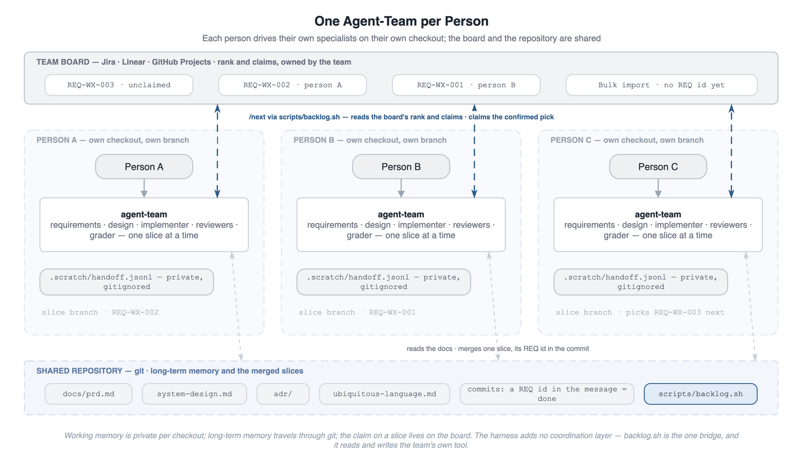

# Human Teams

Can agent-team serve more than one person on the same codebase? Yes. Each person drives their own agent-team on their own checkout and their own vertical slice. The people coordinate through the tracker and branch flow the team already runs — Scrum, Kanban, Jira, a board of any kind. The harness adds no second coordination layer of its own. This page states what is per person and what is shared, where the partition line runs, and the rules that keep parallel slices from colliding.

The [README](../README.md) carries the concepts; [`agentic-harness.md`](agentic-harness.md) carries the loop model and the definition of a slice. "Agent-team" here means the specialist roster one person converses with ([Glossary](glossary.md)), never Claude Code's Agent Teams feature ([`specialist-agent-workflow.md` § Beyond the current bar](specialist-agent-workflow.md#beyond-the-current-bar)).

## Per Person and Shared

The harness keeps two memory tiers ([`agentic-harness.md` § Disciplines as Memory and Feedback](agentic-harness.md#disciplines-as-memory-and-feedback)). One is per checkout; the other travels through git. That split is what makes parallel use work without a shared server or a shared session.

| Surface | Scope | Shared through |
|---|---|---|
| `.scratch/` — the handoff log, the implementation plan, escalations | One checkout, one active slice; gitignored on every channel | Nothing. A second person never reads it. |
| The agent session and its intake conversation | One person | Nothing. Decisions leave the session as records and docs. |
| `docs/prd.md`, `docs/system-design.md`, `docs/adr/`, `docs/ubiquitous-language.md` | The project | Git: a slice's doc writes merge with the code. |
| Git history | The project | Git: `/next` treats a REQ id in a commit message as done. |
| The team tracker (Jira, Linear, a board) | The team | The team's own tool. It holds who took which slice. |

Working memory is private by construction, so two people never contend for one ledger. Long-term memory is shared by construction, so a decision one person's intake records reaches the next person after merge. The tracker is the one surface the harness does not carry: the claim on a slice. The team's tool already holds claims, and a second registry inside the repo drifts from it.

One checkout per person. Two people driving agent-team in one checkout share one `.scratch/`, and each one's `route` call reads the other's records as its own slice.

## The Partition Line Is the Slice

A slice is one vertical, independently usable behavior cutting through every layer it touches ([`agentic-harness.md` § What a Slice Is](agentic-harness.md#what-a-slice-is)). Two slices on different behaviors touch different files; two slices on the same behavior touch the same ones. The assignment rule follows: **no two people hold slices of the same requirement at the same time**, and where the PRD allows, they hold slices in different bounded contexts ([`ddd-principles.md`](ddd-principles.md)). Bounded contexts are the coarse partition; requirements are the fine one.

Overlap still occurs on the shared ground every slice writes: the PRD narrative, the design doc's Contracts rows, the vocabulary, and foundational code. The rules below keep that overlap small and its merges mechanical.

## The Same Flight Levels, One Agent-Team per Person

The [README](../README.md#the-force-multiplier-and-your-part-in-it) sets out three flight levels: within a slice, across slices, and the whole codebase. A team of humans adds no level. It puts more than one person on the first level and keeps the other two shared.

| Flight level | Solo | Team of humans |
|---|---|---|
| Within a slice | one person, one agent-team | one agent-team per person, each on its own checkout |
| Across slices | the same person, via `/next` | the team, via its board; each person's `/next` reads that board |
| Whole codebase | the same person in the architect seat | one architect seat, whoever holds it |

The levels differ in who decides, not in what holds the direction. The whole set of durable docs, the PRD, the design doc, the decision log, and the vocabulary, holds it at every level, together with the tests. Every agent-team on every checkout reads the same set, and that is what keeps three people's slices pointed the same way.

The agent-team stays a per-person instrument. Nobody shares one; a person's specialist roster reads the shared docs and the shared board and works one slice. The human team's own structure, whichever it already has, is the across-slices level, unchanged.

  

## Coordinate Through the Team's Tracker

The PRD is the product's backlog in the harness sense: every candidate behavior, tagged `[REQ-XX-NNN]`. The tracker is the team's scheduling layer over it: priority, claim, and state. They stay in sync through one field.

The mapping onto the two common flows:

| Practice | Scrum | Kanban |
|---|---|---|
| Writing requirements | Backlog refinement runs `/intake`; the PRD is refined before the sprint | `/intake` runs when an item nears the top of the queue, one at a time |
| Choosing work | Sprint planning selects the REQ ids for the sprint; the board holds them in order | The queue's order is the ranking; `/next` shows it through the connector |
| Claiming | Moving the ticket to in-progress at the daily stand-up or on pick | Pulling the top unclaimed item; `/next` claims it on the confirmed pick |
| Limiting work in progress | One active slice per person, one sprint's worth per team | An explicit WIP limit per column; one active slice per person is the floor |
| Finishing | The merged slice with its REQ id in the commit is the increment; the review is the roster plus the human merge | The merged slice moves the item to done through the team's usual integration |
| Reviewing the flow | Retrospective reads the change grades and the review records for the sprint | Cadence review reads the same, per period |

Both flows leave one thing to the harness: the slice itself, from intake to merge. Both keep one thing to themselves: who does what next. Neither needs a harness-side artifact beyond the REQ id on the ticket.

- **One ticket carries one REQ id.** The ticket names the requirement (`REQ-XX-NNN`) it delivers; a requirement that needs slicing gets one ticket per slice, all naming the same id. A ticket with no REQ id is intake work: the requirement gets written first, through `/intake`, before anyone claims it.
- **Refinement writes the PRD.** Backlog refinement or planning runs the intake conversation at team level ([`agentic-harness.md` § Conversations Stay in Root](agentic-harness.md#conversations-stay-in-root)). The product expert records the decisions into `docs/prd.md`, and the merged PRD is what every person's `/next` reads. A requirement discussed on a call and never recorded is invisible to every agent.
- **Moving a ticket to in-progress is the claim.** The board answers "who took which slice"; nothing in the repo does. With the connector bound, `/next` moves the ticket after the pick is recorded; unbound, the person moves it by hand.
- **Work-in-progress limit: one active slice per person.** The harness enforces the same limit per checkout; the board makes it visible across people.
- **`/next` reads the board through the connector.** Its candidate set is the PRD's REQ ids minus git history, the Non-Goals table, and the Superseded list. A teammate's in-progress slice is on a branch, so git alone would offer it again. The project-owned `scripts/backlog.sh` closes that gap: bound to the tracker, it supplies the board's order and claims, and the confirmed pick moves the ticket to in-progress ([`backlog-connector.md`](backlog-connector.md)). Unbound, the person skips the ids a teammate holds when choosing. The recommendation is advisory; the pick the person confirms is what gets recorded.
- **The merge commit names the REQ id.** `/next` on every other checkout reads git history for done ids. A squash merge that drops the id from the subject or body re-surfaces the requirement as a candidate on every teammate's next run. The `/ship` skill puts the id in the subject; a squash policy keeps it in the squashed message.

## Serialize the Shared Ground

Work that touches ground every slice depends on lands first, alone. The team fans out after it merges.

- **`foundational` triage.** The system-design expert's first-slice interview writes the vocabulary and the design foundations ([`agentic-harness.md` § The system-design-expert role in depth](agentic-harness.md#the-system-design-expert-role-in-depth)). One person runs it; nobody starts a dependent slice until it merges.
- **`refactor-first` verdicts.** The sibling refactor slice reshapes code other slices build on. It ships before the slice that triggered it and before any parallel slice in the same context.
- **`[depends-on]` chains.** `/next` tags a requirement whose dependency is unmet. The dependency is one ticket, claimed by one person; the dependents wait on the board.
- **Vocabulary changes.** A slice that renames or adds a term in `docs/ubiquitous-language.md` merges before slices that use the term. Two people coining different words for one concept is the drift the vocabulary exists to prevent.

## Branch, Review, Merge

The team's branch policy governs; the harness fits any of them. The shape that keeps merges small:

1. **Start from the merged base.** Pull the shared branch before `/next`, so the PRD, design doc, and vocabulary the agents read are current.
2. **One branch per slice.** The slice ships standalone by definition, so the branch has one merge and one REQ id.
3. **The roster reviews the slice; a human reviews the merge.** The reviewer roster approves the change against the durable docs ([`agentic-harness.md` § Specialist Agents](agentic-harness.md#specialist-agents)). The terminal change grade names how closely the merging human reads it. A `skim` grade is a fast pull-request review; a `scrutinize` grade is a slow one. The grade is advice to the human reviewer, never a merge gate.
4. **Merge early.** A slice that waits accumulates conflicts in the shared docs. The hotspots are the PRD's Non-Goals table and Superseded list, the design doc's Contracts rows, and the vocabulary table. Their conflicts are textual and resolve like any doc conflict, and small slices keep them rare.
5. **Update the base before the slice, not during it.** The roster reviews the uncommitted working tree against `HEAD` (`scripts/changeset.sh`, the one definition the reviewers and the grader share). Pulling the shared branch mid-slice moves `HEAD` under an in-flight review. When a base update cannot wait, take it before the last review pass, so the approval and the merge judge one tree.

## What the Harness Does Not Provide

By design, the harness carries no claim registry, no lock, no shared ledger, and no multi-person session. Each of these already exists in the tools a team runs, and each would be a second copy that drifts from the first. The connector is the one bridge, and it reads and writes the team's tool rather than copying it. The harness's stance is to reuse the disciplines and tools humans built for coordination ([`agentic-harness.md` § What the Harness Is For](agentic-harness.md#what-the-harness-is-for)); the tracker is one of them.
