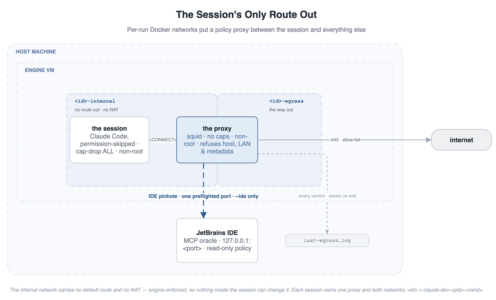

# Claude Dev

User-level tooling for running Claude Code unattended. The harness's loops want `--dangerously-skip-permissions`; claude-dev confines the session in a disposable Linux container whose only path to the internet is a proxy it cannot reconfigure. The agent sees the project directory and a named slice of the host `~/.claude`, and reaches only the allow-listed domains — read the [Security Model](#security-model) for the exact boundary before running an untrusted repo.

| Artifact | Purpose | Where it lives once installed |
|---|---|---|
| `claude-dev` | The command: builds the image on first run, then starts Claude Code confined from any project directory. | `~/.local/bin/claude-dev` |
| `Dockerfile` | The image: Debian 13 slim, JDK 25 (Corretto), Node 24, current Go, Claude Code from Anthropic's signed apt repo as the last (cheap-to-rebuild) layer. Plus squid and socat, which carry the egress boundary and the IDE tunnel, and bubblewrap, which ships unused (see the sandbox note). | `~/.config/claude-dev/Dockerfile` |
| `claude-dev.toml` | The whole confinement policy, as data: extra mounts under `[mounts]`, mode and the egress allow-list under `[egress]`. That is every key — the engine, the network and the bridge hardening have one sensible value each, so none of them is settable at all. Parsed with `tomllib` and never executed; unknown tables and keys are refused by name, so a typo cannot read as policy. Edited by hand, and the tool only ever reads it. | `~/.config/claude-dev/claude-dev.toml` |
| `claude_dev_config.py` | Reads that policy and emits two things: the proxy's rules, and the settings the launcher reads. The rule order is the security property, so it lives here where the suite pins it. | `~/.config/claude-dev/claude_dev_config.py` |
| `ide_preflight.py` | Enumerates a running JetBrains IDE's MCP tools and checks them against the harness's read-only policy. Runs on every launch and warns on drift; with `--ide` it also verifies which IDE has the project open. | `~/.config/claude-dev/ide_preflight.py` |
| `claude_dev_scrub.py` | Builds the container-private `~/.claude.json` replica: the host file scrubbed to this project. | `~/.config/claude-dev/claude_dev_scrub.py` |

## Security Model

Three boundaries, each enforced by something the session cannot reach: **Docker networking** decides where packets may go, **the proxy's config** decides which destinations are allowed, and **the mount set** decides which host files exist inside. Nothing inside the container enforces its own confinement, and no container in this design holds `NET_ADMIN`, `NET_RAW`, or root in the session's namespace.

### Egress: the session has no route out

<p align="center">
  
</p>

The session container is attached to **one per-run internal Docker network**. An internal network carries no default route and no NAT, so the internet, the LAN, and the host are not *routable* from it — that is the engine's doing, not a rule inside the container that something could remove. The only other member of that network is a squid proxy, which is separately attached to a second per-run network for its own way out. Every packet the session sends leaves through the proxy or not at all. `HTTP_PROXY`/`HTTPS_PROXY` are set so proxy-aware tools use it; anything that ignores them finds no route, so the failure direction is denied, never bypassed.

The proxy's policy is generated per launch and is first-match-wins, top to bottom:

1. **Only the session may ask** — the client ACL is the internal network's subnet, read back after creation rather than assumed.
2. **CONNECT only** — HTTPS tunnels; no plaintext HTTP and nothing to cache (`cache deny all`).
3. **The IDE pinhole**, `--ide` only: exactly one preflighted port toward the host machine, placed *above* the private-range deny because the host is at a private address by definition.
4. **Every other private destination is refused** — loopback, RFC1918, carrier NAT, link-local (which covers cloud instance metadata at `169.254.169.254`), and the v6 equivalents. This matches the *resolved* address, so an allow-listed name that points or rebinds into the host or LAN does not connect.
5. **Port 443 only** — an allowed name buys HTTPS and nothing else: git over SSH, plain HTTP, and alternate ports stay denied, so a git remote must be an `https://` URL.
6. **The allow-list** — `[egress] allow` plus per-run `--allow` entries. `--open-egress` replaces this one line with "anything left"; every rule above it still applies.
7. **Deny all.**

Every request the proxy sees is logged with its verdict, outside the session container. Each session names the objects it owns after itself, so a running session `claude-dev-<id>` has its proxy at `claude-dev-<id>-proxy` and its two networks at `claude-dev-<id>-internal` and `claude-dev-<id>-egress` — `docker ps` therefore lists a session next to its own proxy rather than grouping all proxies together. Read the log live with `docker logs -t "$(docker ps -q --filter name=-proxy --filter name=claude-dev | head -1)"`, or from `~/.config/claude-dev/last-egress.log` after it exits. To see what was refused: `grep TCP_DENIED ~/.config/claude-dev/last-egress.log`, or `claude-dev access` for per-host counts. Concurrent sessions share that file — the last to exit wins — so it reads as one session, any project. Claude Code's optional Datadog telemetry is declared off by default (`DISABLE_TELEMETRY=1`) rather than allow-listed, keeping its intake hosts off the list without filling the log with denials. The broader `CLAUDE_CODE_DISABLE_NONESSENTIAL_TRAFFIC` is deliberately never set: it refuses every non-inference first-party API call inside the client, before the socket, which costs `/usage`, the Artifact and Design tools, memory sync and the MCP directory — all of which the allow-list already reaches. The cost of the narrower switch is a few `TCP_DENIED` lines per session for update checks, the changelog fetch and GitHub host lookups. Those denials are the policy working, and reading them beats not knowing what was asked for.

To send telemetry instead, set `telemetry.enabled = true` and uncomment both intake hosts in the config — the key and the allow-list are separate on purpose, so the network policy stays readable off the list alone. Setting the key without the hosts is a supported state: telemetry is attempted and refused at the proxy — the log then shows what it would have sent. The two hosts are `http-intake.logs.us5.datadoghq.com` (event logs, 15s batches) and `browser-intake-us5-datadoghq.com` (error tracking, capped at 100 reports per process). Weigh them as channels, not as settings: both accept arbitrary JSON authenticated only by a public client token compiled into the binary, so allowing them opens a write path out of the session that reads as ordinary traffic in the log. Feature flags need neither — Claude Code fetches them from `api.anthropic.com` with remote evaluation.

An empty allow-list refuses to launch rather than starting a session that can reach nothing, and a launch without `api.anthropic.com` warns by name. Every entry is validated before anything is created: a URL, port, CIDR or bare address is refused by name, because a malformed entry squid would silently ignore reads as allowed while behaving denied.

**The policy is data, and the order is tested.** `claude-dev.toml` is parsed with `tomllib` and never executed, so no file under `~/.config/claude-dev` can run code on the host, and a file that will not parse is refused by name rather than read as an absent policy. The rule list above is generated by `claude_dev_config.py`, whose suite pins each edge that carries a security property — the IDE pinhole above the private-range deny, the port restriction below it and above the allow-list, deny-all last. Reordering any of them fails a test instead of silently changing what a session can reach.

**The engine-side bridge carries no address.** The internal network is created with `inhibit_ipv4`, so the bridge interface Docker would otherwise give an address inside the engine VM has none — the one host-local endpoint that subnet would expose does not exist. Container-to-container traffic is plain L2 and name resolution rides each container's own `127.0.0.11` resolver, so neither depends on that address. An engine too old for the option is not silently accepted: the launch warns, names what stays reachable, and continues. There is no key to silence that warning — its only alternative is an engine that cannot do this, so the fix is the engine (Moby 26+, 2024).

**What the allow-list does not promise.** An allowed domain is an allowed *channel*: `.github.com` on the list means gists and pushes are an exfiltration path — the list's tightness *is* the policy, which is why source control is absent from the shipped default. Pushing needs credentials too, and none are shared by default: `~/.gitconfig` rides in read-only, but host credential helpers (the macOS keychain, `gh auth`) do not work inside — share a token store with `RO`/`RW` if the session must push, or push from the host. Domain fronting is not closed: an allowed domain on a shared CDN is reachable by any co-tenant the agent names in the inner TLS SNI, which the proxy does not see. DNS remains a low-bandwidth side channel — the session's lookups go to the engine's resolver, and the proxy logs destinations rather than blocking names. And the proxy inspects no payload: it decides *where* traffic may go, never *what* is in it. TLS interception would change that and is deliberately not done. Squid resolves a name and then connects, so a name that changes answers between those two steps is a narrow race the `dst` check cannot close. Finally, a compromise of squid itself yields code in its own container as an unprivileged user with no capabilities and no host access — the control's worst case is its own absence.

### Files: `~/.claude` is default-deny, enumerated shared paths only

Inside the container, `HOME` is the host home *path* (not its contents): an empty tmpfs owned by the operator's uid, with only named paths bind-mounted in at their real locations. Same-path mounting is what makes absolute host paths in shared config — a `statusLine` command, a hook, an MCP server — resolve identically in and out.

`~/.claude` inside is a **container-private shadow directory** persisted under `~/.config/claude-dev/state/`. Nothing from the host `~/.claude` is visible there unless it is named here:

- **Session state, shared read-write** — `projects/<this-project>` (transcripts and auto-memory), `tasks/`, `plans/`, `todos/`, `paste-cache/`, `history.jsonl`. These are shared because seamless host↔container switching needs them.
- **Behavior config, shared read-only** — `settings.json`, `settings.local.json`, `CLAUDE.md`, `agents/`, `commands/`, `hooks/`, `output-styles/`, `plugins/`, `rules/`, `skills/`, `workflows/`. These are the files that make a host `claude` run code with no prompt.
- **`~/.claude.json` is never shared.** It is replicated per launch and scrubbed to this project: only `projects` entries overlapping the launch cwd are kept — its ancestors (they carry the trust verdict Claude looks up) and its subtrees (worktrees, subdirectory sessions). Sibling projects' paths, MCP servers, and trust states stay on the host. The host copy always wins; `/login` and trust work normally inside, and nothing written there reaches the host file.

Everything else stays private, so a new Claude Code state directory defaults to private: the failure direction is state loss, never exposure. A permission-skipped session therefore cannot plant a user-scope `mcpServers` entry, flip project trust, rewrite a referenced hook script, or edit `plugins/` and `CLAUDE.md`. Assets kept in `~/.claude` beyond the shared paths — the harness-stats statusline, say — share with one `RO`/`RW` entry; `install.sh` writes that line itself when it creates the config and finds those files present.

**Host managed policy is never shared, deliberately.** This is a personal tool, and carrying an org's `managed-settings.json` inside would mean owning the `managed-settings.d/` fragment directory beside it, a launch-time refusal for managed settings that hard-require the in-process sandbox, and an override variable to escape all of it — enterprise MDM plumbing well past what a personal launcher should hold. The cost is disclosed rather than papered over: inside the container an org's managed policy is absent, so a `/login` here is not bound by `forceLoginMethod`/`forceLoginOrgUUID` and managed permission rules do not apply. **Work governed by managed settings belongs on the host.**

Credentials are container-private: `/login` once inside, and the OAuth token persists in `~/.config/claude-dev/auth`, never inside `~/.claude`. No `ANTHROPIC_API_KEY` is forwarded, so a subscription login stays subscription-billed. Running as the operator's uid, non-root, is also what lets Claude Code accept `--dangerously-skip-permissions`.

Three residuals, disclosed. The project directory is writable by definition: in an already-trusted repo, a hostile session can still plant project-side `.claude/settings.json` hooks — treat untrusted repos as untrusted. The shared session-state directories are session-keyed, not project-keyed, so tainted task, plan, or paste text is a cross-project prompt-level surface. `file-history/` deliberately stays private: `/rewind` restores file content, so a tainted snapshot would become a host file write on a later host-side rewind. For total isolation from host config, the throwaway-`HOME` recipe still works: `CLAUDE_DEV_HOME="$HOME/.config/claude-dev" HOME="$(mktemp -d)" claude-dev` (the pin matters — unpinned, `CLAUDE_DEV_HOME` follows the throwaway and costs a `/login` per run).

### Process: hardening, and why the in-process sandbox stays off

The session container runs with every Linux capability dropped, `no-new-privileges` set so no setuid binary can escalate, and Docker's default seccomp and AppArmor profiles kept — we never pass `=unconfined`. All runtime flags; they add no binaries to the image. The proxy container is hardened identically and additionally runs as the image's unprivileged `proxy` account.

**Claude Code's own in-process sandbox is forced off, and that is a measurement rather than a preference.** The image ships `bubblewrap`, but under Docker's default seccomp profile it cannot create a user namespace. Measured on Rancher Desktop, docker 29.5.2, 2026-07-29:

| Container flags | `bwrap --unshare-all` |
|---|---|
| `cap-drop=ALL` + `no-new-privileges` + default seccomp | no permissions to create new namespace |
| default capabilities + default seccomp | no permissions to create new namespace |
| `cap-drop=ALL` + `cap-add=SYS_ADMIN` + default seccomp | fails at `pivot_root` |
| `cap-drop=ALL` + `no-new-privileges` + `seccomp=unconfined` | works |

So the syscall filter is the blocker, not capabilities. Turning the sandbox on means running the whole container without seccomp — losing a broad, always-on kernel filter over every process — to gain a per-command boundary the container already provides: egress is proxy-controlled whether or not the sandbox is on, and the filesystem is already the project directory plus the named shared paths. The launcher therefore injects `--settings '{"sandbox":{"enabled":false,"failIfUnavailable":false}}'`, which sits at CLI precedence above every settings file, so a host that enables the sandbox — even hard-requiring it via `failIfUnavailable` — still starts here.

Nothing inside can outrank that flag, because host managed policy is not shared into the container at all (see above) — so the injected override is the last word on the sandbox for every launch.

`bubblewrap` stays in the image regardless. It costs about 50KB, the battery does not gate on it, and keeping it means the other posture is reachable without a rebuild on an engine whose default seccomp profile permits unprivileged user namespaces. Opting into it needs both halves: a user-passed `--settings` (it lands after the injected one in argv and displaces it) *and* `--security-opt seccomp=unconfined` on the run.

### Why the IDE bridge exists at all

**A running JetBrains IDE is reachable from every container on the Docker VM.** That is not something claude-dev enables — it is true of a bare `docker run alpine`, and it was true before this tooling existed. The internal network closes it for this session; other containers remain in the open. Three facts compose into the exposure:

- JetBrains binds the IDE's MCP server to `127.0.0.1` deliberately, for security ([IJPL-200926](https://youtrack.jetbrains.com/issue/IJPL-200926); staff confirm the intent). On macOS that bind does **not** confine it: Docker Desktop and Rancher proxy `host.docker.internal` to the host's loopback.
- The server has **no authentication**. Its only gate is a Host check accepting localhost forms — DNS-rebinding protection, satisfied by any client that sets the header.
- The session runs permission-skipped, and its `~/.claude.json` replica — which carries the IDE's endpoint entry — is writable inside.

What the session can do to the IDE over the one opened port is decided by the IDE's own **Settings → Tools → MCP Server → Exposed Tools**. The harness's policy keeps that set read-only (no tool writes a file or executes code), which is what makes the exposure tolerable. And the set is a checkbox that drifts: IDEA 2026.1 shipped an undocumented file-writing `apply_patch` enabled, and Settings Sync moves the set between IDEs and machines.

Every launch with python3 on the host runs `ide_preflight.py` against whatever port the IDE assigned and warns if the exposed set leaves policy. **The warning is not a control** — the network topology and the Exposed Tools setting are. It points at the setting to fix, which is the only thing that restricts what the IDE will do for any client. A launch without `--ide` is silent: the session has no path to the host machine at all, so drift cannot reach it.

With `--ide`, the preflight also enforces the oracle contract: exactly one policy-conforming IDE must have this project open, checked by probing each conforming IDE with a read-only policy tool (so a subdirectory of an open project counts). An unverifiable answer counts as not open. Only a verified port gets a proxy pinhole, and an unprivileged `socat` inside the session listens on the IDE's own `127.0.0.1:<port>` config entry and tunnels it through the proxy's CONNECT — it holds no privilege and enforces nothing, so killing or replacing it gains the session nothing. Zero matches or several skip the bridge with a warning naming the observed state; the session still runs. Four limits worth knowing:

- Preflight is a snapshot, but the topology holds: an IDE started or re-ported mid-session lands on the deny side until relaunch — a missing oracle, never a new opening.
- The opened port is TOCTOU: widening `Exposed Tools` mid-session is forwarded.
- The tunnel forwards the client's literal `Host: 127.0.0.1` inside the CONNECT, which is what the IDE's rebind check wants; IDEA 2026.1.4 accepts that form (verified live).
- Whether the IDE's file watcher sees writes made through the bind mount is unverified. `get_file_problems` refreshes only what the watcher noticed, so a miss degrades to a stale answer with no error.

### Supply chain

**Claude Code installs from Anthropic's GPG-signed apt repository.** The Dockerfile pins the signing key's fingerprint — the value documented at [code.claude.com/docs/en/setup](https://code.claude.com/docs/en/setup) — and rejects a served key that does not match. No `curl | bash` installer remains; a battery tripwire fails the build if that idiom returns (it guards the idiom, not every execution path). Debian and Corretto packages are apt-signature-verified; only the Node and Go tarballs ride TLS alone, resolved to latest at build time. That trade — toolchain currency over pins — and the `debian:13-slim` base choice are recorded in [ADR 2026-07-20](../../docs/adr/2026-07-20-pod-image-supply-chain.md). The image runs non-root by default (`USER dev`); the wrapper overrides it with the operator's uid on every run.

The topology and the reasoning behind it are recorded in [ADR 2026-07-29](../../docs/adr/2026-07-29-proxy-enforced-egress.md), which supersedes the in-container packet filter of [ADR 2026-07-17](../../docs/adr/2026-07-17-default-deny-pod-host-egress.md).

## Installation

### Recommended: via the setup skill

Inside this repo, run the project skill:

```
/install-claude-dev
```

The skill runs the installer's check mode, shows what would change, and applies on approval. An existing `claude-dev.toml` is never overwritten — that file is the operator's policy. `install.sh reset-config` restores the shipped version, keeping the old one as `.bak`.

The installer carries no migration path: it installs the current tool and nothing else. A retired flag is not refused by name either — the launcher forwards anything it does not own to `claude`, so a stale flag surfaces as an unknown-option error from inside the container.

### Manual

```bash
tools/claude-dev/install.sh   # command -> ~/.local/bin, data -> ~/.config/claude-dev
claude-dev build              # one-time image build (pulls toolchains, a few minutes)
```

Then, from any project directory:

```bash
claude-dev                    # Claude Code, permissions skipped, confined
claude-dev --continue         # resume the last session in this project
claude-dev --resume <id>      # resume a specific session by id
claude-dev --allow example.com   # one extra egress domain, this run only
claude-dev access             # print what the next session can access, launch nothing
claude-dev update             # rebuild only the Claude layer (seconds)
```

`access` prints what the next session can access — filesystem and network — then exits. It assembles the real mount plan — policy file, `--rw`/`--ro` flags, the `~/.claude` shared paths — and prints one aligned row per bind mount (`rw`/`ro`, container path, origin). Below the table it prints the egress plan: one `allow` row per effective domain — per-run `--allow` entries marked as this run only — and one `deny` row naming the standing refusals (other domains, non-443 ports, host, LAN and metadata ranges). It runs the same validation a launch does, so it doubles as a policy syntax check; a defective `[mounts]` entry fails here with the launch's own message. Last comes the traffic record: per-host counts from the proxy's access log, `allow` rows for established tunnels and `deny` rows for refusals, each group sorted by count. A running session's proxy is read live; otherwise the record is the log saved on the last exit.

Claude's own flags pass straight through, so a session started on the host resumes inside — this project's transcripts are shared from the host `~/.claude`. Resume keys off the project path, so run it from the same project. `claude-dev help` prints the full flag and env reference.

## Platform Support

The target engine is [Rancher Desktop](https://rancherdesktop.io/), which runs the Docker daemon in a VM on every platform — the session always sits behind a VM boundary:

The engine is resolved by one rule, with no flag or config key to steer it: pin the `rancher-desktop` context when it exists, else use the ambient engine — where docker's own `DOCKER_HOST`/`DOCKER_CONTEXT` still apply. Any other engine is a different security posture, so choosing one is a considered edit to the launcher rather than a per-run option.

| Platform | How that rule reaches Rancher |
|---|---|
| macOS | Pins the `rancher-desktop` context when present, else the ambient socket. Developed and used here |
| Linux | Same resolution — reaches Rancher whether it created the named context (admin access off) or owns the default socket. Not yet smoke-tested |
| Windows | Run from a WSL2 distro with Rancher's integration enabled; the ambient `/var/run/docker.sock` is used (Rancher creates no named context inside WSL). Not yet smoke-tested |

Windows Git Bash and native cmd/PowerShell are not supported: it is a bash script, and MSYS path mangling breaks the `-v` mounts.

Other engines work through the same ambient fallback but are not the target. Plain Docker Engine on native Linux confines by kernel namespace only — the container shares the host kernel — and defines no `host.docker.internal`. The launcher checks that the proxy resolves that name before wiring the bridge, so `--ide` there warns and the session runs without the oracle; there is no flag to point it elsewhere. Rootless Docker and Podman are untested; the `--user $(id -u)` mapping behaves differently there.

## Related

- [`docs/adoption-guide.md` § Claude Dev](../../docs/adoption-guide.md#claude-dev) — when to reach for it.
- [`tools/harness-stats/`](../harness-stats/) — the other user-level tool; same install pattern.
